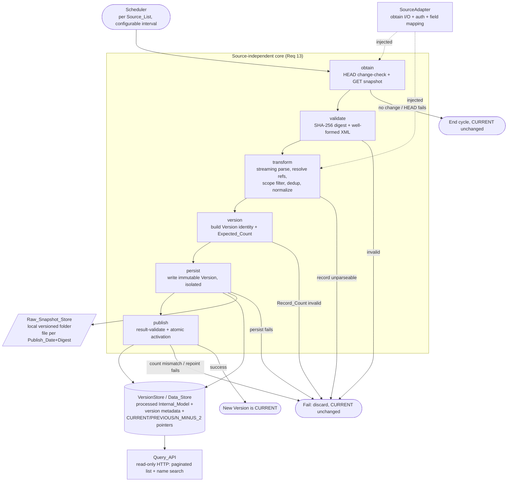
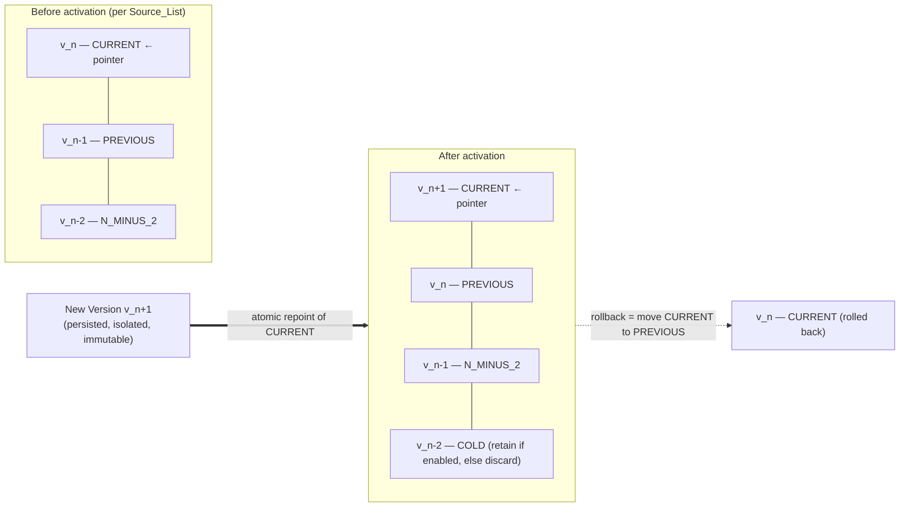

# Design Document

## Overview

This design implements the OFAC sanctions ingestion pipeline described in the requirements document, following the spike's recommended **"Alternativa A — job batch com versão imutável"** (`spike-ofac.md`, sections 7–10 and "Recomendação"). The pipeline periodically polls each OFAC list, downloads the full snapshot only when the content changes, validates and transforms it into a normalized internal model scoped to individuals and entities, persists it as a new **immutable version**, validates the result against the source-reported count, and atomically activates it as `CURRENT`. It maintains three HOT operational versions per list with instant pointer-based rollback.

The design is deliberately organized as six **source-independent stages** — `obtain → validate → transform → version → persist → publish` — driven by a `Scheduler` and parameterized by a per-source `SourceAdapter`. This is the reusable core (Req 13): adding UN or EU later means writing a new adapter, not rewriting the pipeline.

### Grounding in spike evidence

The architecture is a direct consequence of the evidence collected in the spike, not an a priori premise. Key facts that shape it:

- **Full snapshots, no delta** (`spike` §6). Every publication is the entire list, so change detection is cheap (HEAD + `Digest`) and reprocessing is total. There is no webhook or RSS — polling is the only option.
- **Small volume, short processing** (`spike` §5, §9). SDN ≈ 19,249 records (17,373 in scope), Consolidated ≈ 481; full processing ≈ 3.9 s, peak memory ≈ 402 MB, download ≈ 11 s, full cycle ≈ 15 s. This makes full reprocessing cheap and removes any need for checkpointing (Req 11).
- **Parse dominates cost** (`spike` §9: ~98% of the 3.9 s is XML parse). The transform stage therefore uses a **streaming parse** — concretely a StAX (`javax.xml.stream.XMLStreamReader`) iterative parse on the JVM, the Kotlin equivalent of the streaming approach validated by `ofac-data/benchmark.py` (the spike used Python `xml.etree.iterparse`, but it measures the same per-record streaming strategy) — rather than loading a full DOM.
- **Moderate transformation** (`spike` §3). The Advanced XML is heavily nested and uses ID references (`Feature`, `IDRegDocument`, `SanctionsEntry`, `ProfileRelationship`) that must be resolved to build a normalized entry.
- **Overlap between lists** (`spike` "Registros por lista..."): 93 shared `FixedRef` between SDN and Consolidated. The persisted count must be the **distinct union**, not the naive sum, with SDN governing on overlap (Req 6).
- **Multi-source symmetry** (`spike` §12): UN and EU also publish full XML snapshots with no delta; EU requires a token. The common core plus per-source adapter generalizes directly.

### Technology posture

The requirements are technology-agnostic and the interfaces below stay expressed as language-neutral contracts. This design names the concrete stack that realizes those contracts, and where the spike's evidence points clearly it names concrete, evidence-backed choices and justifies them:

**Implementation stack:** the pipeline is realized in **Kotlin on Spring Boot**, built with **Gradle (Kotlin DSL)**. The code is organized in **Hexagonal (Ports & Adapters)** layers — `domain` (pure core), `application` (use-case orchestration + ports), and `adapter` (concrete IO + Spring wiring) — with dependencies pointing inward only (`adapter → application → domain`); this dependency rule is enforced by an **ArchUnit** fitness test (`HexagonalArchitectureTest`) that runs under `check` (see "Architecture layering" below). **Spring Web** serves the read-only `Query_API` (the paginated-list and name-search endpoints). The `Scheduler` contract is realized with Spring **`@Scheduled`** on a configurable, bounded interval defaulting to sub-daily — no OS-level cron is required. Persistence is **PostgreSQL** accessed via **Spring Data (JDBC/JPA) or jOOQ** (the exact data-access library is an implementation choice), with declarative **`@Transactional`** providing the atomic pointer swap required by Req 9 (the `CURRENT`/`PREVIOUS`/`N_MINUS_2` repoint and window rotation commit in a single transaction). XML is parsed with **StAX** (`javax.xml.stream.XMLStreamReader`) for a streaming, memory-bounded parse. Property-based testing uses **jqwik** on the JVM, and unit tests use **MockK** for mocking collaborators. The processed `Internal_Model`, version metadata, and pointers live in PostgreSQL; the raw snapshot lives in a local versioned folder (no object storage). The persistence posture below is unchanged in substance.

- **Ingestion source format:** Advanced XML for every OFAC list (`spike` §2 — canonical, lossless; CSV and legacy XML lose relationships and flatten multi-valued fields).
- **Concrete OFAC SDN source:** the live OFAC Sanctions List Service (SLS) endpoint `https://sanctionslistservice.ofac.treas.gov/api/PublicationPreview/exports/SDN_ADVANCED.XML`. It is externalized as `ofac.source.sdn.url` and wired as the SDN `Source_List` (see "Deployment & bootstrap").
- **Change detection:** HTTP `HEAD` reading `Last-Modified` + `Digest`. Discovered at runtime, the live SLS advertises the `Digest` **only on the HEAD** (format `sha-256<hex>` — the algorithm token glued directly to a lowercase hex digest, no `=` separator, hex not base64); its GET **302-redirects to S3** and the final response does **not** repeat the `Digest` header (it is chunked, with no `Content-Length`). The pipeline therefore carries the HEAD-advertised digest forward into `validate` (`spike` §1, §6; refines the Property 2 / Req 3 realization — see "obtain" and "SourceAdapter").
- **Parse strategy:** streaming/iterative parse (StAX `XMLStreamReader` on the JVM) that advances per `DistinctParty` and clears/advances past each element to bound memory, since parse is the sole cost driver (`spike` §9).
- **Version identity:** `Publish_Date` + SHA-256 `Digest` (`spike` §10 — `Publish_Date` alone is insufficient because more than one publication per day is possible).
- **Persistence engine (`VersionStore` / `Data_Store`):** a **local PostgreSQL database** is the single, chosen storage engine for the processed `Internal_Model` records, the version metadata, and the `CURRENT`/`PREVIOUS`/`N_MINUS_2` pointers. The evidence supports one relational DB: the in-scope volume is small (`spike` §5, §9 — ≈19,249 SDN + 481 Consolidated in scope, a few GB/year), so a single database comfortably holds the processed model, the three HOT versions, and version metadata. The decisive advantage over object storage is that a relational **transaction gives the atomic pointer swap required by Req 9 for free** (object storage could not). Immutability (Req 7) is enforced by writing versions as **insert-only rows** — never updating or deleting within a persisted version. This is a **local** deployment, suitable for the current MVP; the design stays swappable behind the `VersionStore` contract if a different engine is needed later.
- **Raw snapshot storage (`Raw_Snapshot_Store`):** the raw snapshot is **not** stored in PostgreSQL. It is written to a **local versioned filesystem folder** — each downloaded snapshot is written **once** to a file whose name derives from the (`Publish_Date`, `Digest`) pair, kept immutable, and used for faithful reconstruction of a past published list state (`spike` §11). Because distinct (`Publish_Date`, `Digest`) pairs map to distinct file names, two same-day publications never overwrite one another. The integrity check recomputes SHA-256 over the stored **file** bytes and compares it against the recorded `Digest` (Req 14.5, Req 15). The `Raw_Snapshot_Store` is a component distinct from the `VersionStore`; the `VersionStore` only records the file path once the stored file's SHA-256 matches the recorded `Digest`.
- **Query API (`Query_API`):** a **read-only HTTP interface** over the PostgreSQL `Data_Store` serves the `CURRENT` version through two endpoints — a **paginated list** endpoint and a **name-search** endpoint (Req 16). Name search matches the primary name plus aliases with case-insensitive **contains** semantics. Both use offset/limit pagination (default 50, maximum 1000) and a deterministic ordering (e.g., by `FixedRef`) so repeated requests return the same records in the same order. The API reads exclusively from `CURRENT` (never `PREVIOUS`/`N_MINUS_2`/`COLD`) and observes atomic activation consistently — a read resolves to either the old or the new `CURRENT`, never a partial dataset.

The scheduler contract is realized by Spring **`@Scheduled`**, with only the polling interval left as a configuration decision (a configurable, bounded, sub-daily default); the design still specifies the **contract** the scheduler must satisfy. The atomic pointer swap required by Req 9 is now provided by a **PostgreSQL transaction** that updates the pointer row(s) for a `Source_List` in a single committed transaction, so the `CURRENT`/`PREVIOUS`/`N_MINUS_2` repoint and window rotation are atomic; there is no separate, unspecified pointer mechanism anymore. The `VersionStore` contract remains the abstraction and the engine stays swappable.

### Pending business decisions (carried from requirements, not resolved here)

- **List scope default** (Req 12): SDN-only (max-risk MVP) vs SDN + Consolidated (full compliance). Configurable; **no default is hard-coded**.
- **Retention period** (Req 14): undecided; OFAC keeps no history, so any retention is our responsibility. The lifecycle that applies this policy is owned by the `RetentionManager` component (see Components and Interfaces).
- **What to preserve** (Req 14): decided — the raw snapshot is preserved as an immutable **file in the local `Raw_Snapshot_Store`** (Req 15) and the processed model lives in the PostgreSQL `Data_Store`. Faithful reconstruction requires the **raw snapshot file**. The retention **period** remains the only open item.

## Architecture

### Architecture layering (Hexagonal / Ports & Adapters)

The code is organized in three concentric layers; **dependencies point inward only** (`adapter → application → domain`), the application never depends on the adapter, and the domain is framework-free. The six source-independent stages map onto these layers rather than living in feature/stage packages.

| Layer | Packages | Contents |
| ----- | -------- | -------- |
| **domain** (pure core, framework-free) | `com.spike.ofac.domain.{model, transform, version, scope}` | `model` (`VersionId`, `VersionMetadata`, `VersionPointers`, `ScopeConfig`, `RetentionPolicy`, `InternalModelEntry`); `transform` (`AdvancedXmlStreamParser`, `ScopeFilter`, `CrossListDedup`, `ProfileEntryBuilder`, `Transform`); `version` (`Validate`, `VersionStage`); `scope` (`ScopeConfigValidator`). |
| **application** (use cases + ports) | `com.spike.ofac.application` (+ `obtain`/`persist`/`publish`/`retention`), `application.port.in`, `application.port.out` | `Scheduler` (with `SourceListConfig`, `CycleOutcome`) and the obtain/persist/publish/retention orchestration. Ports: `port.in` (`QueryApi`, `Page`, exceptions); `port.out` (`VersionStore` incl. `PointerKind`, `RawSnapshotStore`, `SourceAdapter` incl. `HeadResponse`/`HttpResponse`/`MappingResult`/`SourceEntityType`). |
| **adapter** (concrete IO + Spring wiring) | `com.spike.ofac.adapter.{in.web, in.scheduling, out.persistence, out.source, config}` | `in.web` (`QueryController`); `in.scheduling` (`SchedulerTrigger`, `SchedulerConfiguration`, `OfacSourceListWiring`, `BootstrapImportRunner`); `out.persistence` (`PgVersionStore`, `FsRawSnapshotStore`, `InMemoryVersionStore`, `PgQueryApi`); `out.source` (`OfacAdapter`, `UnAdapter`, `EuAdapter`, `SourceAdapterSupport`, `JdkHttpTransport`); `config` (`RawSnapshotStoreProperties`, `SchedulerProperties`). |

**Dependency rule.** The application talks only to its own port interfaces (`port.in` / `port.out`); concrete adapters are plugged in from the outside. The `domain` depends on nothing in `application` or `adapter` and on no framework (no Spring, JDBC, Jackson, or HTTP client), keeping it unit-testable without any container or IO. This rule is enforced by the **ArchUnit fitness test** `HexagonalArchitectureTest` (in the `test` source set, run under `check`): four rules assert layers only depend inward, the domain does not depend on application/adapter, the application does not depend on adapter, and the domain stays free of Spring/JDBC/Jackson/HTTP.

### Component and data flow

The `Scheduler` triggers one ingestion cycle per configured `Source_List`. Each cycle runs the six stages in order; any stage failing before atomic activation leaves `CURRENT` untouched (Req 11). The `SourceAdapter` is injected into the `obtain` and `transform` stages to encapsulate source-specific I/O (auth) and field mapping (Req 13).



Stage responsibilities and the requirements each satisfies:

| Stage | Responsibility | Primary requirements |
| ----- | -------------- | -------------------- |
| `obtain` | HEAD change-check; GET full snapshot over HTTPS on change | Req 1, Req 2, Req 13 |
| `validate` | SHA-256 digest match; well-formed Advanced XML | Req 3 |
| `transform` | Streaming parse, resolve ID refs, scope filter, dedup, normalize to `Internal_Model` | Req 4, Req 5, Req 6 |
| `version` | Compute `Version` identity; derive `Expected_Count` | Req 7, Req 8 |
| `persist` | Write the raw snapshot as an immutable file to the `Raw_Snapshot_Store`; write all records as a new isolated, immutable `Version` to the `Data_Store`; associate the raw file path only after its stored-file SHA-256 matches the `Digest` | Req 7, Req 15 |
| `publish` | Result-validate against `Expected_Count`; atomic activation; window rotation | Req 8, Req 9, Req 10 |

### Version rotation and pointer model

Each `Source_List` has an independent version line (Req 10.2). Activation is an **atomic pointer repoint** of `CURRENT`; there is never a window with zero resolvable `CURRENT` (Req 9.2). After activation the window shifts: old `CURRENT → PREVIOUS`, old `PREVIOUS → N_MINUS_2`, and anything older becomes `COLD` (retained or discarded per Req 14).



Rollback (Req 10.3) is the inverse pointer move: `CURRENT → PREVIOUS`, with no download, parse, or content mutation. It is rejected if no `PREVIOUS` exists (Req 10.4).

### Cycle isolation and failure model

The new `Version` is written to an isolated location and is invisible to consumers until the `publish` stage repoints `CURRENT` (Req 7.6, Req 9). Because full reprocessing is cheap (`spike` §8, §9), there is no checkpointing: a failed cycle discards partial artifacts and the next cycle restarts from `obtain` (Req 11.3, Req 11.5). Deterministic transformation guarantees a re-run for the same publication yields byte-identical version content (Req 11.4).

### Query API

The `Query_API` is a **read-only** HTTP surface over the PostgreSQL `Data_Store`, entirely separate from the ingestion cycle. It exposes two endpoints, both serving **only** the `CURRENT` version of each configured `Source_List` (Req 16.5):

- **List** — returns `In_Scope_Records` from `CURRENT` using offset/limit pagination (default page size 50, maximum 1000), with pagination metadata (total count, offset, limit) alongside the page (Req 16.1). Results use a deterministic, stable ordering (e.g., by `FixedRef`) so repeated requests with the same offset/limit return the same records in the same order (Req 16.2).
- **Name search** — given a non-empty query string, matches it against each record's primary name **and** its aliases using case-insensitive **contains** matching, returning matching `In_Scope_Records` from `CURRENT` with the same pagination, bounds, ordering, and metadata as the list endpoint (Req 16.3).

Both endpoints resolve `CURRENT` through the `VersionStore`/`Data_Store` pointer, so they observe atomic activation consistently: a read is served from either the old `CURRENT` or the new `CURRENT`, never a partial dataset (Req 16.6, tying to Req 9). When nothing matches — including when a `Source_List` has no `CURRENT` yet — the API returns a success response with an empty page and total count zero, not an error (Req 16.4). The API never modifies any `Version`, pointer, or record (Req 16.9); invalid pagination and missing/empty search queries are rejected as client errors (Req 16.7, 16.8).

## Components and Interfaces

Interfaces are expressed as language-neutral contracts (pseudo-signatures). They define inputs, outputs, and failure outcomes; the concrete runtime binding is a deployment choice.

### Scheduler

Triggers change-detection cycles per configured `Source_List` on a configurable, bounded interval defaulting to sub-daily (Req 1.1).

```
Scheduler.run_cycle(source_list: SourceListConfig) -> CycleOutcome
  # invoked on the polling interval; one call per Source_List per tick
CycleOutcome = { status: SKIPPED_NO_CHANGE | ACTIVATED | FAILED,
                 failed_stage?: StageName, cause?: FailureCause, version_id?: VersionId }
```

The Scheduler owns no ingestion logic; it invokes the stage pipeline and records the `CycleOutcome` so the next scheduled tick retries after a failure (Req 1.6, Req 11.2).

### Deployment & bootstrap

The pipeline runs against a **local PostgreSQL `Data_Store`** wired in `application.yml` (`spring.datasource.url = jdbc:postgresql://localhost:5432/ofac`, user/pass `ofac`/`ofac`); the schema is applied from `src/main/resources/db/schema.sql`. The `Raw_Snapshot_Store` folder (`ofac.raw-snapshot-store.folder`, default `./data/raw-snapshot-store`) and the scheduler interval (`ofac.scheduler.interval`, default `6h`, bounded `[1m .. 1d]`) are configured there too.

Two wiring pieces make the first real import possible (previously the app started with an **empty** source list by design, pending business decisions):

- **`OfacSourceListWiring`** (`adapter.in.scheduling`): a `SourceListConfig` bean for **SDN** — the live SLS URL (externalized as `ofac.source.sdn.url`, gated by `ofac.source.sdn.enabled`, default `true`), `ScopeConfig.SDN_ONLY`, and the credential-free `OfacAdapter`. `SchedulerConfiguration` collects every `SourceListConfig` bean, so this is what gives the running scheduler something to ingest.
- **`BootstrapImportRunner`** (`adapter.in.scheduling`): an `ApplicationRunner` behind the Spring profile **`bootstrap`** that fires one `scheduler.tick()` at startup for an on-demand import (`--spring.profiles.active=bootstrap`). Outside that profile the scheduled trigger drives ingestion on the configured interval (default 6h) and this runner is absent.

**First live import (verified end-to-end, as evidence.)** The SDN version with `publish_date` 2026-08-28 **ACTIVATED** with **17,439 records** persisted (**9,922 Entity + 7,517 Individual**). Counts reconciled exactly: `record_count = expected_count = persisted_count = 17439`, `out_of_scope = 0`, `overlap = 0`, `integrity_ok = true`. The raw snapshot was stored under `data/raw-snapshot-store/<publish_date>_<digest>.xml` and `CURRENT` resolved. This ran on local PostgreSQL (Docker `postgres:16`, db/user/pass `ofac`, `localhost:5432`).

### obtain

```
obtain.check_change(adapter, last_ingested: VersionRef?) -> ChangeDecision
  # HEAD request via adapter; read Last-Modified + Digest (Req 1.2), 30s timeout (Req 1.2/1.6)
ChangeDecision = NO_CHANGE | CHANGED(advertised_digest?, last_modified)
               | HEAD_FAILED(cause)                      # connect error / timeout (Req 1.6)

obtain.download(adapter) -> DownloadResult
  # GET full snapshot over HTTPS, follow <=5 redirects, 120s timeout (Req 2.1, 2.2)
  # OFAC adapters send no credentials (Req 2.3); adapters that need a token supply it (Req 13.3, 13.5)
DownloadResult = SNAPSHOT(bytes, advertised_digest?, content_length?)
               | DOWNLOAD_FAILED(cause)  # connect/http-error/too-many-redirects/timeout/incomplete (Req 2.5)
```

Change detection compares the HEAD `Digest` against the digest of the most recently ingested `Version` (Req 1.3, 1.4). If the `Digest` header is absent, the stage falls back to comparing `Publish_Date` + `Record_Count` read from the snapshot body (Req 1.5). Download completeness (e.g., `Content-Length` vs bytes received) is checked before acceptance (Req 2.4); any failure discards the partial download and leaves `CURRENT` unchanged (Req 2.5).

**Real OFAC digest source (HEAD vs GET), observed at runtime.** The live OFAC SLS advertises the `Digest` on the **HEAD** but its **GET 302-redirects to S3 (GovCloud)**, and that final S3 response does **not** repeat the `Digest` header (it is chunked, no `Content-Length`). Relying on the GET digest alone made `validate` reject every real snapshot as `ABSENT_DIGEST`. The `Scheduler` therefore **carries the HEAD-advertised digest forward** into `validate` (falling back to any digest the GET response carries, e.g. sources that advertise it on the GET as the MockWebServer integration tests do). This refines the realization of Property 2 / Req 3 without changing the requirement: the version's *identity* digest is still the SHA-256 recomputed over the downloaded bytes; the advertised HEAD digest is what integrity validation checks against.

### validate

```
validate.check(snapshot: bytes, advertised_digest?: Sha256) -> ValidationResult
ValidationResult = OK
                 | REJECTED(ABSENT_DIGEST)      # source advertised no digest (Req 3.2)
                 | REJECTED(DIGEST_MISMATCH)     # computed != advertised (Req 3.3)
                 | REJECTED(MALFORMED_XML)       # not well-formed Advanced XML (Req 3.5)
```

Order is fixed (Req 3.1 → 3.4): compute SHA-256 and compare to the advertised `Digest` **before any parsing**; only on match verify well-formedness. The three failure causes are distinct and recorded (Req 3.2, 3.3, 3.5). Every rejection leaves `CURRENT` unchanged.

### transform

```
transform.run(validated_snapshot, adapter) -> TransformResult
TransformResult = OK(entries: [InternalModelEntry],
                     out_of_scope_count: int,
                     record_count: int?,          # from snapshot body (Req 8)
                     diagnostics: [Diagnostic])
                | FAILED(cause)                    # a record could not be parsed (Req 4.8)
```

Behavior:

- **Streaming parse** of Advanced XML `DistinctParty` profiles with a StAX `XMLStreamReader` that advances token-by-token per `DistinctParty` without materializing a full DOM, so memory stays bounded (`spike` §9; the spike's `benchmark.py` measured the same streaming strategy).
- **Reference resolution** (Req 4.2): resolve `Feature`, `IDRegDocument`, `SanctionsEntry`, and `ProfileRelationship` ID references to their referenced records. An unresolved reference produces a diagnostic and processing continues (Req 4.7).
- **Field mapping via adapter** (Req 13.2): the adapter maps source fields to the common `InternalModelEntry`. A required-field mapping failure rejects the source and retains the last good version (Req 13.4).
- **Scope filter** (Req 5): classify by `PartySubTypeID`. Observed mapping from `benchmark.py`: `{"1":"Vessel","2":"Aircraft","3":"Entity","4":"Individual"}`; `IN_SCOPE = {Entity, Individual}`. Vessels and aircraft are excluded (Req 5.2); missing/empty/unrecognized types are excluded with a diagnostic, without aborting (Req 5.3).
- **UTF-8** throughout so non-ASCII names/addresses are preserved exactly (Req 4.3), e.g. `Hải Phòng`, `Skořepka 1058/8 Staré Město` (`spike` §4).
- **Deduplication** by `FixedRef` across lists when scope includes both (Req 6): exactly one record per distinct `FixedRef`; SDN governs on overlap (Req 6.2); the result is the distinct union, not the sum (Req 6.3).
- A record that cannot be parsed into an entry fails the whole stage so no partial version is activated (Req 4.8).

### version

```
version.build(entries, snapshot, publish_date, digest, scope) -> VersionPlan
VersionPlan = { version_id: VersionId,               # (publish_date, digest) — Req 7.2
                expected_count: int }                # Req 8.1
            | REJECTED(RECORD_COUNT_MISSING_OR_INVALID)   # Req 8.4

# Expected_Count = Record_Count - out_of_scope_count - shared_fixedref_overlaps(when multi-list)
```

`VersionId = (Publish_Date, Sha256Digest)` — two same-day publications with different content are distinct versions (Req 7.3). If `Record_Count` is absent or non-numeric, reject (Req 8.4).

### persist

```
persist.write(version_plan, entries, raw_bytes, store, raw_store) -> PersistResult
  # 1. write raw_bytes to raw_store under a name derived from (Publish_Date, Digest) (Req 15.1, 15.2)
  # 2. verify stored-file SHA-256 == recorded Digest before association (Req 15.5)
  # 3. write all records as an isolated, immutable Version to the Data_Store (Req 7.1, 7.6)
  # 4. associate the stored raw file path with the Version metadata (Req 15.6)
PersistResult = PERSISTED(version_id, raw_path)   # records + raw file written and verified (Req 7.1, 7.6, 15.6)
              | FAILED(RAW_WRITE)         # raw file write failed; discard partial file, CURRENT unchanged (Req 15.9)
              | FAILED(RAW_INTEGRITY)      # stored-file SHA-256 != Digest; discard file, CURRENT unchanged (Req 15.7)
              | FAILED(PERSIST)            # record write failed; discard partial version, CURRENT unchanged (Req 7.7)
```

Every persisted record is stamped with its `version_id` (Req 7.4). The raw snapshot bytes are written **once** to the `Raw_Snapshot_Store` under a versioned file name derived from (`Publish_Date`, `Digest`) (Req 15.1, 15.2), and the stored file path is associated with the `Version` metadata **only after** the SHA-256 recomputed over the stored file bytes equals the recorded `Digest` (Req 15.5, 15.6). If the raw write fails or the stored-file integrity check fails, the stage is fail-closed: it discards any partial file, leaves `CURRENT` unchanged, and surfaces the error (Req 15.7, 15.9), consistent with Req 11. The version records are written to an isolated location and are not consumer-resolvable until `publish` activates them (Req 7.6). Once written, the version is immutable — no insert/update/delete within it (Req 7.5), and the raw file is immutable once fully written (Req 15.4).

### publish

```
publish.activate(version_plan, store) -> ActivationResult
  # 1. result-validate: persisted in-scope count (post-dedup) == expected_count exactly (Req 8.2)
  # 2. atomic repoint of CURRENT -> new version (Req 9.1); never zero CURRENT (Req 9.2)
  # 3. rotate window: old CURRENT->PREVIOUS, old PREVIOUS->N_MINUS_2, older->COLD (Req 9.3, 10.5)
ActivationResult = ACTIVATED(version_id)   # resolvable within 5s (Req 9.5)
                 | REJECTED(COUNT_MISMATCH)    # Req 8.3
                 | REJECTED(REPOINT_FAILED)    # pointers unchanged (Req 9.4)

publish.rollback(source_list, store) -> RollbackResult
  # pointer move CURRENT -> PREVIOUS only; no reprocessing, no mutation (Req 10.3)
RollbackResult = ROLLED_BACK(version_id)
               | REJECTED(NO_PREVIOUS)         # Req 10.4
```

### SourceAdapter

The single seam that varies per source (Req 13). It encapsulates obtain I/O (endpoint, auth) and field mapping; the six core stages never change to add a source (Req 13.1).

```
interface SourceAdapter:
  head(url) -> HeadResponse            # exposes Last-Modified, Digest
  get(url) -> HttpResponse             # GET with source-specific auth (Req 13.3)
  map_record(raw_profile) -> InternalModelEntry | MappingError(field)   # Req 13.4
  entity_type_of(raw_profile) -> "Individual"|"Entity"|"Vessel"|"Aircraft"|Unknown
```

- `OfacAdapter`: no credentials (Req 2.3); maps `PartySubTypeID` per the observed ReferenceValueSet. Its `Digest` header parsing accepts **three** forms: the live OFAC glued `sha-256<hex>` / `sha256<hex>` (token glued directly to a lowercase hex digest, no separator), the RFC-3230 `sha-256=<base64>` form, and a bare hex digest — all normalized to the same `Sha256Digest` (see the runtime digest-format note under "Change detection"; regression test `JdkHttpTransportDigestHeaderTest`).
- Future `UnAdapter` / `EuAdapter`: same core; `EuAdapter` supplies a token (Req 13.3), and a missing/invalid token aborts obtain while retaining the last good version (Req 13.5). (`spike` §12.)

### VersionStore

Persistence contract for immutable versions and pointers. Concrete engine is a deployment choice; it must guarantee an **atomic pointer swap** and immutable version records.

```
interface VersionStore:
  put_isolated(version_id, records) -> void       # write not-yet-active version (Req 7.6)
  associate_raw_path(version_id, raw_path) -> void # link stored raw file to version metadata (Req 15.6)
  atomic_set_current(source_list, version_id) -> bool   # single atomic repoint (Req 9.1, 9.2)
  get_pointer(source_list, ptr: CURRENT|PREVIOUS|N_MINUS_2) -> VersionId?
  reclassify_cold(source_list) -> void            # versions older than N_MINUS_2 (Req 10.5)
  last_ingested(source_list) -> VersionRef?        # digest of most recent version (Req 1.3)
  verify_integrity(version_id) -> bool             # delegates to RawSnapshotStore.verify_integrity (Req 14.5)
```

The concrete implementation is a PostgreSQL-backed `VersionStore` (`PgVersionStore`) satisfying this contract: `put_isolated` inserts version rows in a not-active state; `associate_raw_path` records the `Raw_Snapshot_Store` file path on the version metadata after the file's integrity has been confirmed; `atomic_set_current` performs the pointer update inside a single transaction; and `verify_integrity` **delegates to the `RawSnapshotStore`**, which recomputes SHA-256 over the stored raw-snapshot **file** bytes and compares it against the recorded `Digest` — the raw bytes are no longer a database column. The interface signatures are otherwise unchanged — only the binding is made concrete.

### RawSnapshotStore

Storage contract for the raw snapshot files, kept distinct from the `VersionStore`. Concrete backing is a **local versioned filesystem folder**; the contract guarantees write-once immutable files named from (`Publish_Date`, `Digest`) and atomic visibility so partially written files are never associated with a `Version` (Req 15).

```
interface RawSnapshotStore:
  put(version_id, bytes) -> stored_path
    # write-once immutable file named from (Publish_Date, Digest) (Req 15.1, 15.2, 15.4)
    # atomic visibility: in-progress file invisible until fully written (Req 15.3)
    # distinct (Publish_Date, Digest) -> distinct file, no overwrite (Req 15.2)
  get(version_id) -> bytes                    # read stored raw file for reconstruction (Req 14.3)
  verify_integrity(version_id) -> bool        # SHA-256 over stored file bytes == recorded Digest (Req 15.5, 14.5)
```

The concrete `FsRawSnapshotStore` writes to a temporary file and atomically renames it into place so a partial file is never visible as a persisted snapshot (Req 15.3); the raw snapshot is never written into the `Data_Store` (Req 15.8). Two publications sharing a `Publish_Date` but differing in `Digest` (Req 7.2, 7.3) map to two distinct file names, so neither overwrites the other (Req 15.2).

### RetentionManager

Owns the retention lifecycle (Req 14): it is the single component that **applies** the `RetentionPolicy` after each successful activation / window rotation, and exposes the `COLD` integrity check. It sits between the `VersionStore` (which reclassifies displaced versions as `COLD`) and the `RawSnapshotStore` (which holds the raw files), and holds no policy state of its own — the policy is injected configuration.

```
interface RetentionManager:
  apply_after_activation(source_list, policy: RetentionPolicy) -> void   # COLD classify + retain/discard per policy (Req 14.1, 14.2, 14.4)
  check_cold_integrity(version_id) -> IntegrityOutcome                     # verify stored raw file; flag unusable on mismatch, preserve Digest (Req 14.5)

IntegrityOutcome = OK | FLAGGED_UNUSABLE(recorded_digest)
```

- **`apply_after_activation`** runs after `publish` completes a window rotation. When retention is **ENABLED**, every version displaced past `N_MINUS_2` is classified `COLD` and retained together with its raw snapshot file in the `Raw_Snapshot_Store` for the configured `retention_period`; this is applied **independently per `Source_List`**, so retaining or discarding on one list never affects another (Req 14.1, 14.2). When retention is **DISABLED**, the displaced version is discarded, including its raw snapshot file in the `Raw_Snapshot_Store` (Req 14.4).
- **`check_cold_integrity`** verifies a retained `COLD` version's stored raw file through `RawSnapshotStore.verify_integrity` — recomputing SHA-256 over the stored file bytes and comparing against the recorded `Digest`. On mismatch it returns `FLAGGED_UNUSABLE`, marking that `COLD` version unusable for reconstruction while preserving the recorded `Digest` for audit (Req 14.5).

**Collaboration.** `RetentionManager` uses `VersionStore.reclassify_cold` (Req 10.5) and the version metadata `state` field (`HOT` | `COLD`) to move displaced versions into `COLD`, and the `RawSnapshotStore` both to discard raw files (when retention is disabled) and to verify integrity. The relationship between Req 10.5 and Req 14 is a clean separation of concerns: **window rotation always reclassifies versions older than `N_MINUS_2` as `COLD`** (Req 10.5, owned by `publish`/`VersionStore`), and **retention then decides whether those `COLD` versions are kept for the `retention_period` or discarded outright** (Req 14, owned by `RetentionManager`). Rotation demotes; retention keeps-or-drops.

The `retention_period` is a **PENDING business decision** — configurable with no fixed default — consistent with the pending-decisions framing above; `RetentionManager` reads it from the injected `RetentionPolicy` rather than assuming a value.

**Design note — integrity-check trigger.** `check_cold_integrity` is exposed as an **on-demand / where-scheduled** operation. The requirements do not fix when it runs, and this design deliberately does not invent a schedule: the concrete trigger — on read, on a periodic sweep, or on demand — is a deployment/configuration decision left open, not a fabricated requirement.

### QueryApi

Read-only query contract over the `Data_Store`, serving only the `CURRENT` version (Req 16). It never mutates any `Version`, pointer, or record (Req 16.9).

```
interface QueryApi:
  list(source_list?, offset: int = 0, limit: int = 50) -> Page
    # In_Scope_Records from CURRENT, offset/limit pagination (Req 16.1)
    # default limit 50, max 1000; reject invalid (negative/non-numeric/limit>max) as client error (Req 16.8)
    # deterministic, stable ordering, e.g. by FixedRef (Req 16.2)
  search_by_name(query: string, source_list?, offset: int = 0, limit: int = 50) -> Page
    # case-insensitive contains match on primary_name OR any alias, from CURRENT (Req 16.3)
    # reject missing/empty query as client error (Req 16.7)
    # same pagination, bounds, ordering, and metadata as list (Req 16.3)

Page = { records: [InternalModelEntry], total: int, offset: int, limit: int }
     # empty-but-valid page with total 0 when nothing matches or no CURRENT yet (Req 16.4)
```

Both methods resolve `CURRENT` via the `VersionStore`/`Data_Store` pointer and read only from it (never `PREVIOUS`/`N_MINUS_2`/`COLD`, Req 16.5), and observe activation atomically — each read is served fully from the old or the new `CURRENT`, never a partial dataset (Req 16.6). The concrete implementation runs against the local PostgreSQL `Data_Store` using the real `CURRENT` pointer.

**API-first realization.** The HTTP surface is documented API-first: **springdoc-openapi** exposes the generated OpenAPI 3 document at `/v3/api-docs` (+ Swagger UI at `/swagger-ui.html`), while the versioned `src/main/resources/openapi.yaml` is the **source of truth**. An `OpenApiContractTest` (integrationTest source set, run under `check`) boots the app and asserts the springdoc-generated document matches the committed `openapi.yaml` (comparing the parsed YAML trees, ignoring the environment-specific `servers` block), failing the build on any drift — the same fitness-function discipline as the ArchUnit architecture test.

**Toward spec-first (contract-generated interface).** The API is being taken one step further, from *documented* API-first to true **spec-first**: `openapi.yaml` **generates** a Kotlin Spring interface (via the **openapi-generator** Gradle plugin, `kotlin-spring` generator, `interfaceOnly=true`, `useSpringBoot3=true`) together with its own DTOs derived from the contract's schemas, and the `QueryController` **implements that generated interface**, mapping the domain `Page`/`InternalModelEntry` onto the generated DTOs. This puts two complementary guards in play: (1) a **compile-time** guard — the controller must satisfy the generated interface's signatures and DTOs, so the code will not compile if it drifts from the contract, making `openapi.yaml` the compile-time authority; and (2) the existing **runtime** `OpenApiContractTest` comparison, which still guards the generated document against the committed contract under `check`. The two guards catch drift from opposite directions (source shape vs. served document) without changing the read-only contract itself. In the realized setup the app **serves the curated `openapi.yaml` itself** and points Swagger UI at it (`springdoc.swagger-ui.url`), so both the published document and the rendered UI are exactly the versioned source of truth rather than a code-generated doc; the runtime contract test then validates that the contract is well-formed and that every path it declares is actually served, while an HTTP integration test exercises the real endpoints end-to-end (guarding serialization of the generated DTOs).

## Data Models

### InternalModelEntry

The normalized record produced by `transform` and persisted in a `Version`. Multi-valued attributes are zero-or-more; `sanction_programs` requires at least one (Req 4.4). Cardinalities and examples are grounded in `spike` §3–§5.

```
InternalModelEntry:
  fixed_ref:        FixedRef            # stable OFAC id (== uid); dedup + cross-version key (Req 4.1, 6)
  entity_type:      "Individual" | "Entity"     # in-scope only (Req 5); never Vessel/Aircraft
  primary_name:     string              # required; used when zero aliases (Req 4.5)
  aliases:          [Alias]             # 0..N (observed up to 95) (Req 4.4)
  addresses:        [Address]           # 0..N (Req 4.4)
  documents:        [Document]          # 0..N (observed up to 137) (Req 4.4)
  nationalities:    [string]            # 0..N (Req 4.4)
  citizenships:     [string]            # 0..N (Req 4.4)
  birth_dates:      [PartialDate]       # 0..N; year-only or DatePeriod preserved (Req 4.6)
  sanction_programs:[string]            # 1..N; universal in source, 100% present (Req 4.4)
  title:            string?             # 0..1; FeatureType 26 (promoted for triage/match)
  place_of_birth:   string?             # 0..1; FeatureType 9 (promoted; no longer folded into remarks)
  gender:           string?             # 0..1; FeatureType 224, resolved via DetailReference ("Male"/"Female")
  features:         [SourceFeature]     # 0..N; typed catch-all preserving every other in-scope
                                        #   list field (Phone, Email, Website, SWIFT/BIC, Digital
                                        #   Currency Address, D-U-N-S, Organization Type, Additional/
                                        #   Secondary sanctions info, ...) for analyst triage/match.
                                        #   Robust to OFAC adding new FeatureTypes; vessel/aircraft
                                        #   feature types are out of scope. The raw snapshot still
                                        #   preserves 100% of the XML for faithful reconstruction.
  remarks:          [string]            # 0..N; genuine free-text remarks only (Req 4.4)
  relationships:    [Relationship]      # 0..N (Req 4.4)
  version_id:       VersionId           # stamped at persist (Req 7.4)

Alias:        { name: string, type?: string, is_primary: bool, category: STRONG | WEAK }
              # category is the OFAC screen's "Category": WEAK when Alias/@LowQuality="true",
              # else STRONG. A weak alias alone should generally not trigger a match.
SourceFeature:{ type: string, value: string }   # resolved FeatureType label + resolved value
Address:      { raw: string, country?: string, parts?: map }
Document:     { type: string, number?: string, issuer?: string }
PartialDate:  { year: int?, month: int?, day: int?, period?: {from: PartialDate, to: PartialDate} }
              # at least one of year / period must be present; partials never rejected (Req 4.6)
Relationship: { to_fixed_ref: FixedRef, relation_type: string }
Diagnostic:   { fixed_ref?: FixedRef, kind: UNRESOLVED_REF | UNRECOGNIZED_TYPE | MAP_ERROR, detail: string }
```

`PartialDate` explicitly models incomplete birth dates (year-only or `DatePeriod`), which the spike measured at 13.8% of dates (`spike` §4). UTF-8 strings are preserved verbatim (Req 4.3).

### Version and pointers

```
VersionId:
  publish_date:  Date        # <Publish_Date> from the snapshot body
  digest:        Sha256      # SHA-256 of the raw snapshot; disambiguates same-day publications (Req 7.2, 7.3)

VersionMetadata:
  version_id:        VersionId
  source_list:       "SDN" | "Consolidated"     # independent version lines (Req 10.2)
  record_count:      int          # source-reported <Record_Count> (Req 8)
  out_of_scope_count:int          # vessels + aircraft excluded (Req 5, 8.1)
  overlap_count:     int          # shared FixedRef removed when multi-list (Req 6, 8.1)
  expected_count:    int          # Record_Count - out_of_scope - overlap (Req 8.1)
  persisted_count:   int          # in-scope, post-dedup (must equal expected_count) (Req 8.2)
  state:             HOT | COLD   # HOT = CURRENT/PREVIOUS/N_MINUS_2 (Req 10, 14)
  ingested_at:       Timestamp
  raw_snapshot_path?: FilePath    # path into the local Raw_Snapshot_Store for the stored raw file,
                                  #   derived from (Publish_Date, Digest) (Req 15.1, 15.2, 15.6);
                                  #   NOT a database bytea column; optional, populated only after the
                                  #   stored file's SHA-256 matches the recorded Digest (Req 15.5, 15.6)
  integrity_ok?:     bool         # last integrity check over the stored raw FILE bytes vs recorded Digest (Req 14.5, 15.5)

VersionPointers (per source_list):
  current:    VersionId          # never null while any version exists (Req 9.2)
  previous:   VersionId?
  n_minus_2:  VersionId?
```

The `RetentionPolicy` is configuration, not fixed here (Req 14 pending decisions):

```
RetentionPolicy:
  enabled:            bool                 # if false, versions beyond 3 HOT are discarded (Req 14.4)
  retention_period?:  Duration             # PENDING business decision (Req 14)
  preserve:           RAW | MODEL | BOTH   # PENDING; RAW required for faithful reconstruction (Req 14.3)
# When retention is enabled and RAW is preserved, the raw snapshot is preserved as an immutable
# FILE in the local Raw_Snapshot_Store (see Technology posture), named from (Publish_Date, Digest);
# the integrity check (Req 14.5) recomputes and compares the SHA-256 of the stored FILE bytes
# against the recorded Digest (spike §11). The raw snapshot is never stored in the Data_Store (Req 15.8).
```

### PostgreSQL schema sketch

A high-level sketch of how the `VersionStore` maps onto local PostgreSQL (kept deliberately loose — column details and the multi-valued modeling are implementation decisions):

- **`versions`** — one row per immutable version. `version_id` = (`publish_date`, `digest`); columns for `source_list`, the counts (`record_count`, `out_of_scope_count`, `overlap_count`, `expected_count`, `persisted_count`), `state` (`HOT`/`COLD`), `ingested_at`, a nullable `raw_snapshot_path` (a **filesystem path** into the local `Raw_Snapshot_Store`, populated only when retention preserves RAW — there is **no** `bytea`/raw-bytes column; the raw snapshot lives on disk per Req 15.8), and `integrity_ok`. Rows are insert-only (Req 7.5).
- **`records`** — the persisted `Internal_Model` entries, each stamped with its `version_id` (Req 7.4). The multi-valued attributes (aliases, addresses, documents, etc.) are modeled either as child tables or as JSONB columns — this is left as an implementation choice. To back the Query API name search (Req 16.3), the primary-name and alias values are indexed to support case-insensitive **contains** matching (e.g., a trigram/`GIN` index on lowercased primary name and alias values), and the deterministic query ordering (e.g., by `FixedRef`, Req 16.2) is supported by an ordering index; results are constrained to the `CURRENT` `version_id` (Req 16.5). The realized `records` table uses column-per-attribute JSONB for the multi-valued fields, plus dedicated columns for the promoted scalar features (`title`, `place_of_birth`, `gender`) and a `features` JSONB column holding the typed `SourceFeature` catch-all; adding a promoted field is a new column, while new OFAC FeatureTypes flow into `features` without a schema change.
- **`pointers`** — one row per `source_list` holding the `current`/`previous`/`n_minus_2` `version_id`s, updated atomically in a single transaction (Req 9).

The Query API returns a `Page` shape — `{ records, total, offset, limit }` — where `total` is the exact count of matching `CURRENT` `In_Scope_Records` and `records` is the ordered slice for the requested `offset`/`limit` (Req 16.1).

The `ScopeConfig` validity rules (Req 12), with no committed default:

```
ScopeConfig = SDN_ONLY | SDN_AND_CONSOLIDATED     # only valid values (Req 12.1)
# CONSOLIDATED_ONLY -> rejected (Req 12.4); absent/empty/unrecognized -> rejected (Req 12.5)
```

## Correctness Properties

*A property is a characteristic or behavior that should hold true across all valid executions of a system — essentially, a formal statement about what the system should do. Properties serve as the bridge between human-readable specifications and machine-verifiable correctness guarantees.*

The pure-logic parts of this pipeline (change detection, integrity validation, scope filtering, deduplication, normalization, count reconciliation, and the version-pointer state machine) are well suited to property-based testing: they have clear input/output behavior and universal properties that hold across a large generated input space. The external I/O parts (HTTP HEAD/GET, timeouts, latency SLAs, scheduler timing) are not — those are covered by integration and example tests in the Testing Strategy. The properties below were derived from the prework analysis; redundant criteria were consolidated so each property carries unique validation value.

### Property 1: Change-detection decision

*For any* pair of source states (advertised `Digest`, or `Publish_Date` + `Record_Count` when the `Digest` header is absent) and any last-ingested version state, the pipeline decides to download the snapshot *if and only if* the content differs: identical digests (or identical `Publish_Date` + `Record_Count` in the fallback path) yield `NO_CHANGE` with no download, and any difference yields `CHANGED`.

**Validates: Requirements 1.3, 1.4, 1.5**

### Property 2: Validation accepts exactly the intact, well-formed snapshots

*For any* byte sequence and any advertised digest, `validate` returns `OK` *if and only if* the SHA-256 of the bytes equals the advertised digest **and** the bytes are well-formed Advanced XML, with the digest checked before parsing; equivalently, flipping any single byte of a valid snapshot causes rejection with `DIGEST_MISMATCH`, an absent advertised digest causes rejection with `ABSENT_DIGEST`, and malformed content causes rejection with `MALFORMED_XML`.

**Validates: Requirements 3.1, 3.2, 3.3, 3.4, 3.5**

### Property 3: Scope filter yields zero vessels and aircraft

*For any* snapshot with an arbitrary mix of entity types, the resulting `Internal_Model` contains zero records of type Vessel or Aircraft, contains exactly the records whose `PartySubTypeID` maps to Individual or Entity, and excludes every record with a missing, empty, or unrecognized type while emitting one diagnostic per excluded record and continuing.

**Validates: Requirements 5.1, 5.2, 5.3**

### Property 4: Deduplication produces the distinct union

*For any* pair of in-scope record sets drawn from the SDN and Consolidated lists, the persisted result contains exactly one record per distinct `FixedRef` (no duplicates), each shared-`FixedRef` record equals its SDN representation, and the persisted count equals the size of the distinct union of `FixedRef`s across both lists — which is at most the naive sum, with equality only when there is no overlap.

**Validates: Requirements 6.1, 6.2, 6.3**

### Property 5: Transformation preserves data and resolves references (round-trip)

*For any* validated snapshot of in-scope profiles — including profiles with zero aliases, non-ASCII characters in names and addresses, and incomplete birth dates (year-only or `DatePeriod`) — transforming and then serializing/persisting preserves every field exactly (unicode code points and partial dates unchanged), uses the primary name when there are no aliases, and resolves every resolvable ID reference (`Feature`, `IDRegDocument`, `SanctionsEntry`, `ProfileRelationship`) to its referenced record.

**Validates: Requirements 4.1, 4.2, 4.3, 4.5, 4.6**

### Property 6: Every persisted entry has at least one sanction program

*For any* transformed snapshot, every persisted in-scope `Internal_Model` entry has at least one sanction program, while the other multi-valued attributes (aliases, addresses, documents, nationalities, citizenships, birth dates, relationships, remarks) are permitted to be empty.

**Validates: Requirements 4.4**

### Property 7: Unresolvable references do not abort transformation

*For any* snapshot containing an arbitrary number of unresolvable ID references, transformation completes without aborting, emits exactly one diagnostic per unresolved reference identifying the record and the reference, and still produces entries for all remaining resolvable records.

**Validates: Requirements 4.7**

### Property 8: Count reconciliation

*For any* validated snapshot, the derived `Expected_Count` equals `Record_Count` minus the count of out-of-scope records minus the count of shared-`FixedRef` overlaps (the overlap term being zero when the scope is a single list), and the count of persisted in-scope records after deduplication equals that `Expected_Count` exactly; if any in-scope record is dropped, the counts differ and activation is rejected.

**Validates: Requirements 8.1, 8.2, 8.3**

### Property 9: Version identity disambiguates same-day publications

*For any* two snapshots with the same `Publish_Date` but different content, their version identities differ (because the SHA-256 `Digest` component differs), so the two are persisted as separate versions.

**Validates: Requirements 7.2, 7.3, 7.4**

### Property 10: Atomic activation never yields zero CURRENT

*For any* sequence of activation operations on a `Source_List`, at every observable point `CURRENT` resolves to exactly one fully-persisted version and is never zero or partial; a newly persisted version is not consumer-resolvable before its activation completes, and after activation `CURRENT` resolves either fully to the prior version (if activation was rejected) or fully to the new version.

**Validates: Requirements 7.6, 9.1, 9.2**

### Property 11: Version window rotation keeps the three most recent HOT versions

*For any* sequence of N successful activations on a `Source_List`, the HOT versions are exactly the three most recently activated versions in order (`CURRENT`, `PREVIOUS`, `N_MINUS_2`), the HOT count never exceeds three, and every version displaced past `N_MINUS_2` becomes `COLD` with its record content left unchanged (immutability preserved).

**Validates: Requirements 7.5, 9.3, 10.1, 10.5**

### Property 12: Activate-then-rollback restores the prior CURRENT (round-trip)

*For any* `Source_List` state that has a `PREVIOUS`, activating a new version and then rolling back restores `CURRENT` to the exact version that was `CURRENT` before the activation, moving pointers only, without downloading, reprocessing, or mutating the content of any version.

**Validates: Requirements 10.3**

### Property 13: Per-list independence

*For any* interleaving of activation and rollback operations across two `Source_Lists`, operations on one list leave every version and pointer (`CURRENT`, `PREVIOUS`, `N_MINUS_2`) of the other list unchanged.

**Validates: Requirements 10.2**

### Property 14: Failure safety before activation

*For any* cycle in which any stage (obtain, validate, transform, version, or persist) fails before atomic activation completes, the pointer trio (`CURRENT`, `PREVIOUS`, `N_MINUS_2`) resolves to exactly the same versions after the cycle as before it, and no partially-persisted version is ever exposed as `CURRENT`.

**Validates: Requirements 2.5, 7.7, 9.4, 11.1, 11.5, 13.4, 13.5**

### Property 15: Deterministic reprocessing

*For any* single publication snapshot, two independent full runs of the pipeline produce identical persisted version content (same `version_id` and byte-identical record set), so a re-run after a failed cycle yields exactly the version a first-attempt success would have produced.

**Validates: Requirements 11.4**

### Property 16: Scope configuration validation

*For any* scope configuration value, it is accepted *if and only if* it is exactly `SDN_ONLY` or `SDN_AND_CONSOLIDATED`; `CONSOLIDATED_ONLY` and any absent, empty, or unrecognized value are rejected with the pipeline ingesting nothing.

**Validates: Requirements 12.1, 12.4, 12.5**

### Property 17: Retention integrity and reconstruction fidelity

*For any* `COLD` version retained with its raw snapshot **file** in the `Raw_Snapshot_Store` while retention is enabled, the SHA-256 recomputed over the stored raw **file** bytes equals the version's recorded `Digest` and re-transforming that raw file reproduces the recorded model; if the stored file bytes do not hash to the recorded `Digest`, the version is flagged unusable for reconstruction while the recorded `Digest` is preserved for audit.

**Validates: Requirements 14.3, 14.5**

### Property 18: Raw snapshot file naming, immutability, and integrity association

*For any* two versions, distinct (`Publish_Date`, `Digest`) pairs map to distinct `Raw_Snapshot_Store` file names and neither file overwrites the other; a fully written raw file's SHA-256 equals the recorded `Digest`; and a partially written file is never associated with a `Version` nor used for reconstruction — the file path is associated with the `Version` only after its stored-file SHA-256 matches the recorded `Digest`.

**Validates: Requirements 15.2, 15.3, 15.5, 15.6**

### Property 19: Query name-search correctness over CURRENT

*For any* `CURRENT` dataset and any non-empty query string, the name-search endpoint returns exactly the `In_Scope_Records` whose primary name **or** any alias contains the query case-insensitively, drawn only from `CURRENT` (never `PREVIOUS`, `N_MINUS_2`, or `COLD`), and returns no other records.

**Validates: Requirements 16.3, 16.5**

### Property 20: Query pagination correctness

*For any* dataset and any valid `offset`/`limit` within bounds, the paginated pages form a stable, non-overlapping, complete partition of the full deterministically ordered result set (concatenating consecutive pages reproduces the full ordered set with no gaps or duplicates), the reported `total` equals the exact size of that full result set, and any invalid pagination (negative, non-numeric, or `limit` exceeding the maximum) is rejected as a client error rather than returning a partial or invalid page.

**Validates: Requirements 16.1, 16.2, 16.8**

## Error Handling

Error handling follows one overriding rule from the spike (§8) and Requirement 11: **the operational `CURRENT` version is never at risk**. Every stage before atomic activation is fail-closed — on any error it discards its in-progress artifacts, leaves the pointer trio untouched, records an observable outcome naming the failed stage, and lets the next scheduled cycle restart from `obtain`. No checkpointing is used because full reprocessing costs ≈15 s (`spike` §9).

| Stage | Failure causes | Handling | Requirements |
| ----- | -------------- | -------- | ------------ |
| obtain (HEAD) | connect error, 30s timeout | end cycle, `CURRENT` unchanged, record failure for retry | 1.6 |
| obtain (GET) | connect error, non-success HTTP, >5 redirects, 120s timeout, incomplete download | discard partial download, `CURRENT` unchanged, `DOWNLOAD_FAILED(cause)` | 2.5 |
| obtain (adapter auth) | missing/invalid token (e.g. EU) | abort obtain, retain last good version, error names source + auth | 13.5 |
| validate | absent digest, digest mismatch, malformed XML | reject snapshot, `CURRENT` unchanged, record distinct cause | 3.2, 3.3, 3.5 |
| transform (soft) | unresolvable ID reference, unrecognized/missing entity type | emit diagnostic, continue with remaining records | 4.7, 5.3 |
| transform (hard) | record cannot be parsed into an entry; adapter required-field mapping failure | fail the stage, no partial version, retain last good version; mapping error names source + field | 4.8, 13.4 |
| version | `Record_Count` absent or non-numeric | reject version, `CURRENT` unchanged | 8.4 |
| persist (raw write) | writing the raw snapshot file to the `Raw_Snapshot_Store` fails | discard any partially written file, `CURRENT` unchanged, error that raw snapshot was not persisted (fail-closed) | 15.9 |
| persist (raw integrity) | SHA-256 over stored file bytes ≠ recorded `Digest` | discard the stored raw file, `CURRENT` unchanged, error naming stored-file integrity mismatch | 15.7 |
| persist | record write failure | discard partially persisted version, `CURRENT` unchanged | 7.7 |
| publish (validate) | persisted count ≠ `Expected_Count` | reject version, `CURRENT` unchanged | 8.3 |
| publish (activate) | atomic repoint fails | preserve prior `CURRENT`/`PREVIOUS`/`N_MINUS_2`, emit error | 9.4 |
| rollback | no `PREVIOUS` available | reject, `CURRENT` unchanged | 10.4 |
| config | invalid scope value | reject config, ingest nothing, surface error | 12.4, 12.5 |
| Query API | invalid pagination (negative, non-numeric, or `limit` > max) | reject request with a client error, no partial/invalid page | 16.8 |
| Query API | missing or empty name-search query | reject request with a client error, return no results | 16.5, 16.7 |
| retention | stored `COLD` fails digest integrity check (recompute SHA-256 over the stored `Raw_Snapshot_Store` file bytes ≠ recorded `Digest`) | flag version unusable, preserve recorded `Digest` for audit | 14.5 |

Diagnostics (soft errors) are accumulated per cycle and reported alongside the `CycleOutcome`; they do not by themselves fail a cycle except where the requirement mandates a hard failure (Req 4.8). All failure outcomes are observable and name the stage that failed (Req 11.2).

## Testing Strategy

The strategy is dual: **property-based tests** verify the universal properties above across a large generated input space, and **unit/integration tests** cover specific examples, boundaries, external I/O, and configuration wiring. The two are complementary — property tests catch general logic errors, example and integration tests pin down concrete behavior and the parts of the system that do not vary meaningfully with input.

The concrete test tooling for the Kotlin/Spring Boot stack is: **jqwik** for property-based tests (including its stateful/model-based mode for the version-pointer properties), **JUnit 5 with kotest assertions** for example and unit tests, **MockK** as the mocking library used to isolate collaborators in unit tests, **Testcontainers (PostgreSQL)** for DB integration tests against a real Postgres, **MockWebServer or WireMock** for the `obtain` HEAD/GET tests, and a **temporary local folder** standing in for the `Raw_Snapshot_Store` in tests.

Integration tests exercise **real components**: Testcontainers PostgreSQL for the DB and the real `@Transactional` transaction, and MockWebServer/WireMock serving real HTTP — the component under integration is never mocked. MockK appears in integration tests only in a pointed role: injecting a failure into a collaborator or stage to exercise the fail-closed paths (Req 7.7, 9.4, 11, 15.7, 15.9), or isolating an external collaborator that is not the focus of that test — never replacing the real Postgres or HTTP being integrated.

### Fixtures from real data

The real sample files in `ofac-data/` are used as high-fidelity fixtures:

- `sdn_advanced.xml` — full SDN Advanced XML (19,249 profiles) for end-to-end transform, count-reconciliation, and performance sanity checks.
- `cons_advanced.xml` — full Consolidated Advanced XML (481 profiles) for the multi-list dedup path (93 known overlaps, 388 Consolidated-exclusive; `spike` "Registros por lista...").
- `sdn.xml` (legacy) and `sdn.csv` — cross-checks that type counts and `Record_Count` (19,249) agree across formats, matching the spike's verification.
- `benchmark.py` — reference for the streaming-parse approach and the `PartySubTypeID → type` ReferenceValueSet used by `OfacAdapter`.

Property-test generators are seeded with structures drawn from these files (alias counts up to 95, documents up to 137, non-ASCII names, year-only and `DatePeriod` births, records with zero aliases) so generated inputs stay representative of real OFAC data.

### Property-based tests

- Use **jqwik**, the property-based testing library for the JVM, as the chosen PBT library for this Kotlin/Spring Boot stack. Do not hand-roll a PBT framework.
- Each of the 20 correctness properties is implemented as a **single** property-based test.
- Minimum **100 iterations** per property test.
- Each test is tagged with a comment referencing its design property, format: **Feature: ofac-sanctions-ingestion, Property {number}: {property_text}**, covering Properties 1–20 (including the new raw-store property 18 and the Query API properties 19 and 20).
- The version-pointer properties (10, 11, 12, 13, 14) are exercised as **stateful/model-based** property tests using **jqwik's stateful testing** mode: generate random sequences of activate/rollback/new-version operations across one or more `Source_Lists` and assert the invariants after every step against a simple reference model of the pointer trio.
- Properties 2, 15, 17, and 18 rely on hashing/round-trip: generate arbitrary byte mutations and content and assert accept/reject, file-naming/immutability, and reconstruction equalities over the stored raw **file** bytes.
- Properties 19 and 20 (Query API) generate random `CURRENT` datasets plus random query strings and `offset`/`limit` values, asserting the case-insensitive contains match semantics over primary name + aliases, the stable non-overlapping complete pagination partition, exact `total`, and rejection of invalid pagination.

### Unit and example tests

Focused examples for the edge cases and branches that the prework classified as EXAMPLE/EDGE_CASE. **MockK** is used here to mock collaborators — such as the `SourceAdapter`, the `Version_Store`/`Raw_Snapshot_Store`, or individual stages — when unit-testing the `Scheduler`/cycle orchestration and the per-stage logic in isolation:

- Redirect boundary: 5 redirects accepted, 6 rejected (Req 2.2); truncated download rejected (Req 2.4).
- Distinct validation causes labelled correctly: absent digest, mismatch, malformed XML (Req 3.2, 3.3, 3.5).
- Zero-alias profile produces an entry using the primary name (Req 4.5); an unparseable record fails the stage with no partial version (Req 4.8).
- `Record_Count` absent/non-numeric rejected (Req 8.4); count mismatch (drop one record) rejected (Req 8.3).
- Rollback with no `PREVIOUS` rejected (Req 10.4); repoint failure leaves pointers unchanged (Req 9.4).
- Scope wiring: `SDN_ONLY` persists no Consolidated record (Req 12.2); `SDN_AND_CONSOLIDATED` runs the dedup path (Req 12.3).
- Adapter behavior: `OfacAdapter` sends no credentials (Req 2.3); `EuAdapter` attaches a token (Req 13.3) and aborts on a missing token retaining the last good version (Req 13.5); required-field mapping failure names source + field (Req 13.4).
- Retention branches: displaced version discarded when disabled (Req 14.4), classified `COLD` and retained when enabled (Req 14.1, 14.2).
- Raw snapshot store: two distinct (`Publish_Date`, `Digest`) pairs produce two distinct files with no overwrite and the versioned naming scheme (Req 15.2); a fully written file is immutable (Req 15.4); integrity is verified by recomputing SHA-256 over the stored **file** bytes vs the recorded `Digest` (Req 15.5); a raw write failure is fail-closed with `CURRENT` unchanged and no association (Req 15.9); the raw snapshot is never written to the `Data_Store` (Req 15.8).
- Query API examples: empty/missing name-search query rejected as a client error (Req 16.7); invalid pagination (negative, non-numeric, `limit` > 1000) rejected (Req 16.8); an empty-but-valid page with `total` 0 when a `Source_List` has no `CURRENT` yet or nothing matches (Req 16.4); reads are read-only and leave every `Version`, pointer, and record unchanged (Req 16.9).

### Integration and smoke tests

For behavior that is external or does not vary with input (prework INTEGRATION/SMOKE):

- HEAD/GET against a **MockWebServer/WireMock** endpoint serving a fixture (or recorded responses): headers read (Req 1.2), HTTPS GET with timeouts (Req 2.1), new `CURRENT` resolvable within 5 s (Req 9.5).
- Scheduler smoke test: the Spring `@Scheduled` trigger fires per `Source_List` on the configured interval; interval-bounds validation and sub-daily default (Req 1.1).
- Reusable-core structural test: a second adapter drives the same six stages unchanged (Req 13.1, 13.2).
- **Architecture fitness test (ArchUnit):** `HexagonalArchitectureTest` (in the `test` source set, run under `check`) enforces the Hexagonal dependency rule — layers only depend inward (`adapter → application → domain`), the domain does not depend on application/adapter, the application does not depend on adapter, and the domain stays free of Spring/JDBC/Jackson/HTTP.
- **Real-OFAC digest regressions** (surfaced by the first live import, not covered by the earlier MockWebServer tests): `JdkHttpTransportDigestHeaderTest` covers the digest header formats — the live glued `sha-256<hex>` form plus the RFC-3230 base64 and bare-hex forms; and a new `SchedulerCycleSmokeTest` case ("digest advertised on HEAD but absent on GET still validates and activates") covers the HEAD-only digest carry-forward.
- Failure-observability examples: each stage's failure yields an outcome naming that stage (Req 11.2); a fresh cycle after a failed one succeeds reading only the source, not intermediate artifacts (Req 11.3).
- Query API endpoints against a **Testcontainers (PostgreSQL)** `Data_Store` with the real `CURRENT` pointer: the list and name-search endpoints return records only from `CURRENT` (never `PREVIOUS`/`N_MINUS_2`/`COLD`, Req 16.5); reads stay consistent across an in-flight activation, resolving to either the old or the new `CURRENT` and never a partial dataset (Req 16.6); the response carries `total`/`offset`/`limit` metadata (Req 16.1).

### Pending decisions affecting tests

Retention tests treat the retention **period** as a configuration parameter, since it is an open business decision (Req 14). Reconstruction-fidelity tests (Property 17) and the raw-store property (Property 18) treat the raw store as a **local versioned file** in the `Raw_Snapshot_Store` — recomputing SHA-256 over the stored **file** bytes against the recorded `Digest`, asserting the (`Publish_Date`, `Digest`) file naming and immutability, and never reading the raw snapshot from the `Data_Store` (Req 15). Integration tests run against a **Testcontainers (PostgreSQL)** instance plus a temporary local raw-snapshot folder standing in for the `Raw_Snapshot_Store`, and the atomic-activation tests exercise the real `@Transactional` database transaction while the Query API tests read through the real `CURRENT` pointer. Scope tests do not assume any default value (Req 12).

### Performance testing

The spike measured processing a full SDN snapshot at ~3.9 s, with ~98% of that spent in the XML parse, a peak of ~402 MB, and a full cycle around 15 s (spike §9). Performance guards therefore target three hotspots: the **parse+transform** path (the dominant cost), the **atomic-activation SLA** (a new `CURRENT` must be resolvable within 5 s, Req 9.5), and **Query API endpoint latency** — especially the name-search contains match over primary name + aliases, which leans on the trigram/GIN indexes.

- **Parse+transform microbenchmarks (JMH):** use the **Java Microbenchmark Harness (JMH)** to benchmark the StAX parse plus transform over the real `ofac-data/sdn_advanced.xml` fixture (19,249 profiles). JMH runs live in a **separate Gradle source set/task**, kept out of the normal test suite because JMH runs are slow. The spike's `benchmark.py` serves as the reference baseline for expected timings.
- **HTTP load/latency (Gatling):** use **Gatling** as the primary tool to load- and latency-test the Query API list and name-search endpoints; **k6** is noted as an equivalent alternative.
- **CI regression guard (optional):** a lightweight **JUnit-based time/memory regression guard** over the real fixture can run in CI as a cheap early-warning check, distinct from the rigorous JMH benchmarks.

These performance tests are **non-functional guards** and do not replace the correctness properties.

### Mutation testing

With 20 correctness properties plus the example and integration tests, mutation testing measures whether the suite actually **catches injected defects** — validating test effectiveness beyond line coverage.

- **Framework:** **PITest** ([pitest.org](https://pitest.org)) via its Gradle plugin, together with **pitest-kotlin** to cut noise from Kotlin-generated null-checks and synthetics that otherwise surface as equivalent (unkillable) mutants.
- **Scope:** focus mutation on the **pure-logic packages** the properties cover — transform, scope filter, dedup, count reconciliation, version-identity, and the version-pointer state machine (Properties 1–16, 18–20) — where a high mutation score gives the most confidence. Start with a **mutation-score threshold gate on those pure-logic packages only**, keeping the I/O/adapter packages out of the initial gate because real-integration behavior and Kotlin equivalent mutants add noise there.
