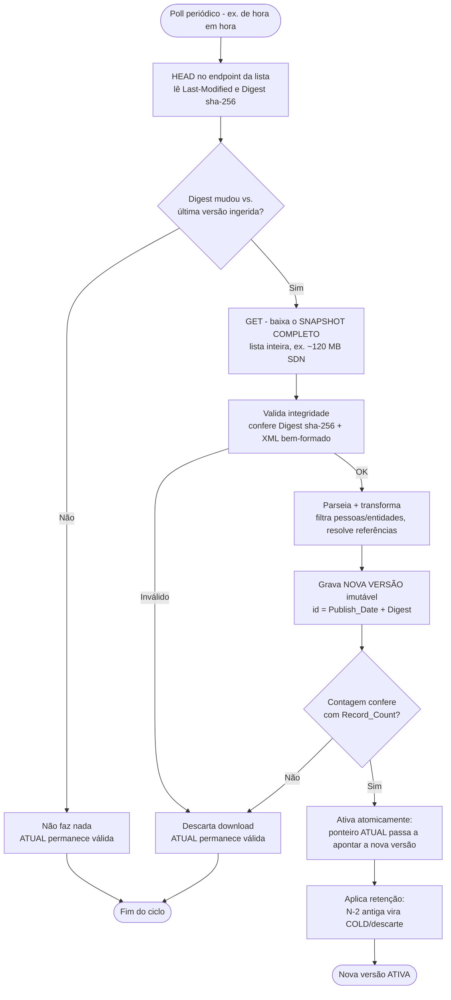
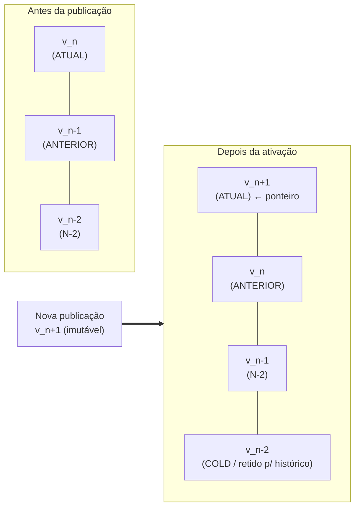

# Spike Técnico — Ingestão da Lista de Sanções da OFAC

## Objetivo

Investigar as características técnicas, operacionais e de dados da lista de sanções da OFAC para compreender a complexidade real do processo de ingestão, e reunir evidências que permitam comparar **duas alternativas técnicas** adequadas ao processamento encontrado.

Esta investigação é **agnóstica de tecnologia**: nenhum framework, mecanismo de processamento ou arquitetura é assumido de antemão. A escolha de tecnologia deve ser **consequência das evidências** coletadas, nunca uma premissa.

## Sumário executivo

Leitura rápida para quem não vai percorrer o documento inteiro.

- **Fonte:** OFAC publica via Sanctions List Service (SLS), sem autenticação, em **snapshot completo** (não há delta). Duas listas: **SDN** (bloqueio total) e **Consolidated/não-SDN** (sanções setoriais). Formato recomendado: **Advanced XML**.
- **Volume (20/08/2026):** SDN = **19.249** registros (17.373 pessoas+entidades); Consolidated = **481**. Cruzando por identificador estável, **19.637 registros distintos** (17.761 no escopo pessoas+entidades). A Consolidated agrega **388 exclusivos**.
- **Quebra por tipo (SDN):** 9.871 entidades, 7.502 pessoas, 1.534 navios, 342 aeronaves. Filtrar pessoas+entidades remove ~9,7% dos registros.
- **Atualização:** sem horário fixo, várias vezes por semana, podendo haver mais de uma por dia. Detecção barata por HEAD comparando `Last-Modified`/`Digest` sha-256; baixa só quando muda (polling).
- **Benchmark:** processar a SDN inteira leva **~3,9 s** (98% é parse do XML), pico de **402 MB**, ~4.962 reg/s. Download (~11 s) custa mais que o processamento. Ciclo completo ~15 s.
- **Complexidade:** Volume BAIXO–MÉDIO, Duração CURTA, Transformação MODERADA, Recuperação = **reprocessamento total aceitável**, Frequência MÉDIA–ALTA.
- **Recomendação:** **Alternativa A — job batch com versão imutável** (baixar snapshot → validar → transformar → gravar nova versão → ativar atomicamente). Simples, recuperação trivial, replicável para ONU/UE trocando o adaptador de leitura. A Alternativa B (diff/changelog) fica para quando auditoria de mudanças virar requisito.
- **Multi-fonte:** ONU e UE seguem o mesmo padrão (snapshot completo em XML, sem delta); o pipeline é reutilizável, só muda o adaptador por fonte (a UE exige token).
- **Pendências:** decisões de negócio (escopo de lista, retenção de histórico, o que preservar). A OFAC **não** mantém histórico — se quisermos, a preservação é nossa.

## Status de preenchimento

- **Seções 1–6, 12**: preenchidas com evidência real (documentação oficial + arquivos baixados em 23/08/2026), incluindo distribuições de qualidade, diff derivado e comparativo multi-fonte OFAC×ONU×UE.
- **Seções 10–11**: preenchidas com o que a fonte determina; itens de decisão de negócio marcados como **DECISÃO PENDENTE**.
- **Seção 9 (benchmark)**: preenchida com medições reais (5 execuções em 23/08/2026).
- **Classificação / Alternativas / Recomendação**: completas, sustentadas pelas evidências coletadas (incluindo o benchmark da seção 9).

## Evidências e fontes oficiais consultadas

- Sanctions List Service (SLS): https://sanctionslist.ofac.treas.gov/Home/index.html
- Página do SLS: https://ofac.treasury.gov/sanctions-list-service
- API pública de exports: `https://sanctionslistservice.ofac.treas.gov/api/PublicationPreview/exports/{FORMATO}`
- FAQ formatos/atualização: https://ofac.treasury.gov/faqs/topic/1641 , https://ofac.treasury.gov/faqs/20
- Retirada de formatos legados (PIP/DEL/SDALL.ZIP): https://ofac.treasury.gov/recent-actions/20230706
- Mudança de namespace XML/Advanced: https://ofac.treasury.gov/recent-actions/20240507_44
- Arquivo de mudanças (não há versões históricas): https://ofac.treasury.gov/specially-designated-nationals-list-sdn-list/archive-of-changes-to-the-sdn-list

**Arquivos baixados** (23/08/2026, via `curl` a partir da API pública do SLS; `Last-Modified` da publicação: 20/08/2026 17:02 GMT):

| Arquivo             | Formato | Tamanho (bytes) | Tamanho (MB) |
| ------------------- | ------- | --------------- | ------------ |
| SDN.XML             | XML     | 28.875.846      | ~27,5        |
| SDN.CSV             | CSV     | 5.647.099       | ~5,4         |
| SDN_ADVANCED.XML    | XML     | 126.151.493     | ~120,3       |
| CONS_ADVANCED.XML   | XML     | 4.534.269       | ~4,3         |

**Descrição de cada arquivo:**

Há dois eixos que diferenciam os arquivos: **qual lista** ele contém (SDN ou Consolidated) e **qual formato/riqueza** de dados (legado XML, CSV plano, ou Advanced XML).

- **SDN.XML** — A lista **SDN** (Specially Designated Nationals and Blocked Persons) no formato **XML legado** da OFAC. É a lista principal: pessoas, entidades, navios e aeronaves com quem cidadãos/empresas dos EUA estão proibidos de negociar (ativos bloqueados). O formato legado é aninhado, porém mais simples — traz listas separadas de aliases, endereços, documentos, programas e datas por registro. Bom para integrações que não precisam do detalhamento completo. É a mesma lista do SDN_ADVANCED, só que com menos campos.

- **SDN.CSV** — A **mesma lista SDN**, mas em **CSV plano** (12 colunas fixas, sem cabeçalho de nomes; campo vazio = `-0-`). É o formato mais leve (~5,4 MB) e o mais pobre em dados: relacionamentos não existem, e múltiplos aliases/endereços/documentos são achatados ou concatenados em texto numa coluna de "remarks". Serve para consumo rápido em planilha ou checagem simples de nome, **não** para uma ingestão fiel. É o mesmo conteúdo do SDN.XML/SDN_ADVANCED, com perda de granularidade.

- **SDN_ADVANCED.XML** — A **mesma lista SDN**, no formato **Advanced** (padrão baseado no modelo da ONU/Al-Qaida Sanctions Committee). É a versão **mais completa e canônica**: usa perfis (`DistinctParty`) com características tipadas (`Feature`: gênero, local/data de nascimento, nacionalidade), documentos (`IDRegDocument`), medidas de sanção (`SanctionsEntry`) e **relacionamentos entre entidades** (`ProfileRelationship`), tudo referenciado por ID. É o maior arquivo (~120 MB) justamente porque não perde informação. **É o formato recomendado como fonte de ingestão.**

- **CONS_ADVANCED.XML** — A lista **Consolidated (não-SDN)** no formato **Advanced XML** (mesma estrutura rica do SDN_ADVANCED). A Consolidated agrega as sublistas que **não** fazem parte da SDN — por exemplo NS-MBS (Menu-Based Sanctions), NS-CMIC (Chinese Military-Industrial Complex) e SSI (Sectoral Sanctions Identifications). São restrições mais específicas/setoriais, não o bloqueio total da SDN. É bem menor (~4,3 MB) porque contém muito menos entradas que a SDN.

Em resumo: **SDN.XML, SDN.CSV e SDN_ADVANCED.XML são a mesma lista (SDN) em três níveis de detalhe crescente**; **CONS_ADVANCED.XML é uma lista diferente** (a Consolidated não-SDN), no formato rico. Para uma ingestão fiel, os candidatos são **SDN_ADVANCED.XML** e **CONS_ADVANCED.XML**.

## Quando usar cada lista (SDN x Consolidated)

A escolha **não** é sobre formato (isso já está decidido: Advanced XML), mas sobre **qual conjunto de sanções** o produto precisa cobrir. A diferença entre as listas é a **natureza da restrição legal**, não a estrutura dos dados.

| Aspecto              | SDN List                                              | Consolidated List (não-SDN)                                   |
| -------------------- | ----------------------------------------------------- | ------------------------------------------------------------- |
| Tipo de sanção       | **Bloqueio total** de bens e ampla proibição de transações | **Restrições parciais/setoriais** (menos que bloqueio total) |
| O que é exigido      | Bloquear bens e não transacionar                      | Não exige bloquear bens; aplica proibições específicas por registro (ex.: setor, dívida/capital, importação) |
| Sublistas            | Lista única (SDN & Blocked Persons)                   | Agrega NS-MBS, NS-CMIC, SSI, FSE e outras                     |
| Volume (20/08/2026)  | 19.249 registros (17.373 pessoas+entidades)           | 481 registros (todos pessoas+entidades)                       |
| Sobreposição         | — | Um registro da Consolidated **pode também estar na SDN**; nesse caso vale a regra mais restritiva (SDN) |

**Regra de decisão:**

- **Use SOMENTE a SDN** se o objetivo for o caso de uso mais comum de *compliance* — evitar negociar com quem tem bloqueio total de bens. É a lista de maior risco e cobre a grande maioria dos registros. Menor volume de trabalho, cobertura da restrição mais severa.

- **Use SDN + Consolidated (as duas)** se o produto precisar de *screening* **completo/regulatório**. A orientação da própria OFAC e a prática de compliance é **checar ambas**: a Consolidated captura sanções setoriais (ex.: NS-CMIC/Rússia, SSI) que **não** aparecem na SDN. Ignorar a Consolidated deixa um vão de cobertura para restrições que existem, mesmo sem bloqueio total.

- **Nunca use SOMENTE a Consolidated** — ela é complementar à SDN, não substituta.

**Recomendação para este projeto:** como a Consolidated é pequena (481 registros, ~4,3 MB), tem a **mesma estrutura** do SDN Advanced e é lida pelo **mesmo pipeline** (só muda o endpoint de download), o custo marginal de incluí-la é baixo. A decisão passa a ser puramente de **escopo de produto/compliance**:

- MVP focado em risco máximo (bloqueio total) → **SDN apenas**.
- Cobertura de compliance completa → **SDN + Consolidated**, tratadas como duas fontes do mesmo pipeline (ver seção 12).

> Observação de escopo: seja qual for a decisão, o filtro **pessoas + entidades** (seção 5) se aplica igualmente — a Consolidated, aliás, só contém pessoas e entidades (nenhum navio/aeronave).

## Registros por lista, sobreposição e total distinto

Cruzamento feito pelo **identificador estável** (`uid`/`FixedRef`) entre SDN.XML e CONSOLIDATED.XML (publicação de 20/08/2026). Como a OFAC confirma que um registro da Consolidated **pode também estar na SDN**, somar as duas listas conta em dobro os registros compartilhados. Por isso o número que importa é o de **registros distintos** (união dos `uid`).

**Todos os tipos:**

| Métrica                              | Registros |
| ------------------------------------ | --------- |
| SDN (total)                          | 19.249    |
| Consolidated (total)                 | 481       |
| Soma bruta (SDN + Consolidated)      | 19.730    |
| Sobreposição (`uid` nas duas listas) | 93        |
| Somente na SDN                       | 19.156    |
| Somente na Consolidated              | 388       |
| **Registros distintos (união)**      | **19.637** |

**Escopo pessoas + entidades (Individual + Entity):**

| Métrica                              | Registros |
| ------------------------------------ | --------- |
| SDN (escopo)                         | 17.373    |
| Consolidated (escopo)                | 481       |
| Soma bruta                           | 17.854    |
| Sobreposição                         | 93        |
| Somente na SDN                       | 17.280    |
| Somente na Consolidated              | 388       |
| **Registros distintos (união)**      | **17.761** |

**Leitura do delta:**

- A **SDN é dominante**: 19.156 registros (99,5% da SDN) existem **só nela**.
- A Consolidated tem **388 registros exclusivos** — são os que se perde se ingerir apenas a SDN. Todos são pessoas/entidades e correspondem a sanções setoriais (NS-CMIC, SSI, NS-MBS etc.) que **não** têm bloqueio total.
- **93 registros estão nas duas listas** ao mesmo tempo. Para esses, a regra mais restritiva (SDN, bloqueio total) prevalece; no armazenamento eles devem ser **deduplicados por `uid`** para não gerar registro duplicado.
- **Total real a persistir:** ingerindo as duas listas com deduplicação, são **19.637 registros distintos** (ou **17.761** no escopo pessoas+entidades). Não 19.730 — a soma ingênua contaria os 93 compartilhados duas vezes.

> Implicação para o pipeline: ao ingerir SDN + Consolidated, deduplicar por `uid` na etapa de transformação/persistência. O ganho de cobertura ao incluir a Consolidated é de **388 registros exclusivos** — pequeno em volume, mas relevante para compliance setorial.

## Escolha de lista por cenário: PLD/AML, KYC e Screening Online

Os três cenários têm objetivos e momentos diferentes, e isso muda qual lista faz sentido. O denominador comum: **identificar se um cliente ou uma contraparte de transação é uma pessoa/entidade sancionada.**

| Cenário | O que faz | Momento | Lista recomendada | Por quê |
| ------- | --------- | ------- | ----------------- | ------- |
| **KYC / Onboarding** | Verifica quem é o cliente ao abrir conta/cadastro | No cadastro e em re-verificações periódicas | **SDN + Consolidated** | No onboarding vale ter a cobertura mais ampla possível; incluir os 388 exclusivos da Consolidated evita aceitar cliente sob sanção setorial. Custo marginal baixo. |
| **PLD / AML** | Previne lavagem de dinheiro; monitora comportamento e partes envolvidas | Contínuo + re-screening a cada atualização da lista | **SDN + Consolidated** | PLD exige diligência ampla e trilha de auditoria. Cobertura completa reduz risco regulatório; a sobreposição de 93 deve ser deduplicada. |
| **Screening Online (transações)** | Bloqueia/segura uma transação em tempo real conforme as partes | Síncrono, no fluxo da transação (baixa latência) | **SDN (núcleo) + Consolidated (se latência permitir)** | A SDN é a de maior risco (bloqueio total) e resolve o caso crítico de barrar a transação. A Consolidated é setorial (ex.: restrição de dívida/capital), nem sempre justifica bloquear em tempo real — pode ir para verificação assíncrona. |

**Como cada cenário usa os dados:**

- **KYC / Onboarding — identificar possíveis clientes sancionados.**
  Casa nome + dados do cliente contra os registros. Aqui os **aliases** (43.844) são críticos: um sancionado costuma aparecer com variações de nome. Datas de nascimento, nacionalidade e documentos (todos mapeados na seção 3) ajudam a desambiguar homônimos e reduzir falso positivo. Recomenda-se o **Advanced XML** justamente por trazer esses campos ricos. Use **SDN + Consolidated**.

- **PLD / AML — monitoramento contínuo.**
  Além do match de nome, os **relacionamentos** (`ProfileRelationship`, 8.971) importam: uma parte pode não estar sancionada diretamente, mas estar ligada a quem está. O re-screening deve rodar **a cada nova publicação** (seção 6 — múltiplas por semana), o que reforça a necessidade de detectar mudança por hash/`Last-Modified` (seção 1) e versionar (seção 10). Use **SDN + Consolidated**, com histórico preservado para auditoria (seção 11).

- **Screening Online — transações em tempo real.**
  Aqui a prioridade é **latência**. A decisão de bloqueio síncrono deve se apoiar na **SDN** (risco de bloqueio total). A **Consolidated** pode ser consultada no mesmo match se o desempenho permitir, ou tratada de forma assíncrona (alertar/revisar depois), já que suas restrições são setoriais e normalmente não exigem barrar a transação instantaneamente. O modelo interno normalizado (seção 3) deve ser indexado por nome/alias para busca rápida.

**Resumo da decisão:**

- **Identificar possíveis clientes sancionados (KYC/PLD):** priorizar **cobertura** → **SDN + Consolidated**, deduplicadas por `uid`, com aliases e relacionamentos.
- **Barrar transações com sancionados em tempo real (Screening Online):** priorizar **latência e risco crítico** → **SDN** no caminho síncrono; **Consolidated** como camada complementar (síncrona se couber no orçamento de latência, senão assíncrona).
- Em todos os cenários, o filtro **pessoas + entidades** se aplica (navios/aeronaves fora de escopo — seção 5), e a fonte de dados recomendada é o **Advanced XML** pela riqueza de campos.

> Observação: esta seção trata de **adequação técnica das listas aos cenários**, não de aconselhamento jurídico/regulatório. As obrigações formais de compliance devem ser confirmadas com a área jurídica/regulatória.

## Glossário

- **Snapshot**: republicação completa da lista inteira.
- **Atualização incremental**: publicação que contém apenas as mudanças em relação a uma publicação anterior.
- **Entry (Entidade)**: registro principal de uma entidade sancionada.
- **Elemento relacionado**: dado secundário ligado a uma Entry (alias, endereço, documento, programa, relacionamento).
- **Identificador estável**: identificador fornecido pela OFAC que permite reconhecer a mesma entidade entre publicações diferentes.
- **Versão**: estado processado e publicado da lista em um ponto no tempo (ex.: ATUAL, ANTERIOR, N-2).
- **HOT**: versões usadas operacionalmente.
- **COLD**: versões preservadas apenas para histórico/auditoria.

---

## 1. Características da fonte

- **Quais listas precisam ser consumidas?**
  > Duas listas principais: a **SDN List** (Specially Designated Nationals and Blocked Persons) e a **Consolidated List (não-SDN)**. A Consolidated agrega as sublistas não-SDN (ex.: NS-MBS, NS-CMIC, SSI, FSE etc.).

- **Qual endpoint oficial disponibiliza cada lista?**
  > Fonte oficial: **Sanctions List Service (SLS)**, lançado em 06/05/2024. Downloads via API pública:
  > - SDN: `https://sanctionslistservice.ofac.treas.gov/api/PublicationPreview/exports/SDN.XML` (e `.CSV`, `.FF`, `SDN_ADVANCED.XML`)
  > - Consolidated: `.../exports/CONSOLIDATED.XML`, `.../exports/CONS_ADVANCED.XML`, etc.
  > O site legado `treasury.gov/ofac/downloads/` ainda serve alguns formatos, mas o SLS é o canal atual.

- **Quais formatos estão disponíveis para cada lista?**
  > **XML** (legado, namespace próprio), **Advanced XML** (padrão baseado no modelo da UN, mais rico), **CSV** e **FF** (fixed-field/delimitado), além de **PDF**. Os formatos legados **PIP, DEL e SDALL.ZIP foram descontinuados** em setembro/2023.

- **O conteúdo é snapshot completo ou atualização incremental?**
  > **Snapshot completo** em todos os formatos de dados. Cada publicação é a lista inteira. Não há endpoint oficial de "delta" estruturado (existem apenas os avisos textuais de "recent actions" e um `sdnew` legado, não estruturado para ingestão).

- **Frequência de atualização:**
  > **Sem cronograma predeterminado.** A OFAC declara que nomes são adicionados/removidos "conforme necessário" e que atualiza "a um ritmo cada vez maior". Na prática há publicações em múltiplos dias por semana; **pode haver mais de uma atualização no mesmo dia**. Não há horário fixo garantido.

- **Como identificar que há uma nova publicação (sinal observável)?**
  > Três sinais observáveis na resposta HTTP do arquivo:
  > 1. Header **`Last-Modified`** (ex. observado: `Thu, 20 Aug 2026 17:02:00 GMT`).
  > 2. Header **`Digest: sha-256=<hash>`** — muda quando o conteúdo muda.
  > 3. Campo **`<Publish_Date>`** e **`<Record_Count>`** dentro do próprio XML (ex.: `08/20/2026`, `19249`).

- **A fonte fornece versão / timestamp / hash / checksum?**

  | Atributo  | Presente / Ausente |
  | --------- | ------------------ |
  | Versão    | Parcial — `<Publish_Date>` no XML e atributo `Version` no Advanced XML; não há número de versão incremental global |
  | Timestamp | **Presente** — header `Last-Modified` + `<Publish_Date>` |
  | Hash      | **Presente** — header `Digest: sha-256` |
  | Checksum  | **Presente** — o próprio `Digest` sha-256 serve como checksum |

- **Requisitos para consumo automatizado:**

  | Requisito             | Situação |
  | --------------------- | -------- |
  | Autenticação          | **Não exigido** — download público, sem token/API key |
  | Headers               | Nenhum obrigatório; segue redirects (`-L`). Resposta seta cookies de balanceador (BIG-IP F5) que não precisam ser reenviados |
  | Rate limits           | **Não documentado** oficialmente |
  | Restrições de acesso  | **HTTPS obrigatório** (HSTS), `X-Frame-Options: DENY`. Histórico de erros 403 em redirects durante a migração para o SLS |
  | Disponibilidade       | Serviço público de produção; sem SLA publicado |

- **Fontes oficiais consultadas:** ver seção "Evidências e fontes oficiais consultadas" acima.

---

## 2. Características dos arquivos

Arquivos reais baixados em 23/08/2026 (publicação de 20/08/2026).

**SDN — comparação entre formatos:**

| Característica                     | SDN.XML (legado)         | SDN.CSV               | SDN_ADVANCED.XML          |
| --------------------------------- | ------------------------ | --------------------- | ------------------------- |
| Formato                           | XML 1.0                  | CSV                   | XML 1.0 (padrão UN)       |
| Tamanho                           | ~27,5 MB (28.875.846 B)  | ~5,4 MB (5.647.099 B) | ~120,3 MB (126.151.493 B) |
| Registros principais              | 19.249 `<sdnEntry>`      | 19.249 linhas         | 19.249 `<DistinctParty>`  |
| Estrutura                         | Aninhada (listas)        | Plana, 12 colunas     | Fortemente aninhada       |
| Encoding                          | UTF-8 (declara `standalone`); conteúdo predominante ASCII | ASCII/UTF-8 | UTF-8 |
| Compressão                        | Nenhuma (há ZIP opcional)| Nenhuma               | Nenhuma (há ZIP opcional) |
| Hash/checksum                     | Header `Digest: sha-256` | idem                  | idem                      |
| Frequência de atualização         | Sem cronograma fixo      | idem                  | idem                      |
| Snapshot / incremental            | Snapshot completo        | Snapshot completo     | Snapshot completo         |
| Local de download                 | `.../exports/SDN.XML`    | `.../exports/SDN.CSV` | `.../exports/SDN_ADVANCED.XML` |
| Data/hora de download             | 23/08/2026               | 23/08/2026            | 23/08/2026                |

- **Comparação entre formatos — campos presentes:**
  > - **CSV**: 12 colunas fixas (uid, nome, tipo, programa, título, chamada, tipo de doc, e uma coluna "remarks" que concatena aliases e outros dados em texto). Campo vazio = `-0-`. **Sem cabeçalho de nomes de coluna.**
  > - **XML legado**: listas separadas de `aka`, `address`, `id` (documentos), `program`, `dateOfBirth`, `nationality`, `citizenship`. Estrutura relacional simples.
  > - **Advanced XML**: modelo completo com `DistinctParty`, `Alias`, `Feature` (características tipadas: datas, locais, gênero etc.), `IDRegDocument`, `SanctionsEntry`, `ProfileRelationship`, `SanctionsMeasure`. Referências por ID entre entidades.

- **Possível perda de dados (CSV vs Advanced XML):**
  > O **CSV perde granularidade significativa**: relacionamentos (`ProfileRelationship`) não existem; múltiplos endereços/documentos/datas ficam achatados ou concatenados na coluna de remarks; features tipadas (gênero, local de nascimento, etc.) não têm colunas próprias. O **Advanced XML é a fonte mais completa**; o XML legado é intermediário. **Recomendação de ingestão: Advanced XML** como fonte canônica.

---

## 3. Estrutura dos registros

Mapeamento baseado no **SDN_ADVANCED.XML** (formato mais rico) com contagens reais.

| Campo                        | Presente? | Aninhado? | Opcional? | Cardinalidade observada |
| ---------------------------- | --------- | --------- | --------- | ----------------------- |
| Identificador de origem      | Sim (`FixedRef`/`uid`) | Não | Não | 1 |
| Tipo de entidade             | Sim (Individual/Entity/Vessel/Aircraft) | Não | Não | 1 |
| Nome principal               | Sim (`Alias` primário) | Sim | Não | 1 |
| Aliases                      | Sim (`Alias`) | Sim | Sim | 0..N (total 43.844) |
| Endereços                    | Sim (`Feature`/`Location`) | Sim | Sim | 0..N |
| Documentos                   | Sim (`IDRegDocument`) | Sim | Sim | 0..N (total 22.554) |
| Nacionalidades               | Sim (`Feature`) | Sim | Sim | 0..N |
| Cidadanias                   | Sim (`Feature`) | Sim | Sim | 0..N |
| Datas/locais de nascimento   | Sim (`Feature`/`DatePeriod`) | Sim | Sim | 0..N |
| Programas de sanção          | Sim (`SanctionsEntry`/`SanctionsMeasure`) | Sim | Não | 1..N (19.435 entries) |
| Observações (remarks)        | Sim (`Comment`) | Sim | Sim | 0..N |
| Relacionamentos              | Sim (`ProfileRelationship`) | Sim | Sim | 0..N (total 8.971) |

- **Existe identificador estável?**
  > **Sim.** Cada perfil tem um `FixedRef` (equivalente ao `uid` do legado, ex.: `36`, `173`) que é **persistente entre publicações**. É a chave para reconhecer a mesma entidade ao longo do tempo. (Ressalva: a OFAC não mantém versões históricas oficiais — ver seção 11 — mas o identificador em si é estável enquanto a entidade estiver na lista.)

- **Se não existir identificador estável:** não se aplica (existe).

- **Complexidade de transformação:** `MODERADA`
  > Justificativa: o Advanced XML é fortemente aninhado e usa **referências por ID** (features, documentos, relacionamentos e medidas de sanção apontam para o perfil por ID). Transformar em representação interna exige resolver essas referências e desnormalizar features tipadas — não é um mapeamento 1:1 trivial (como seria o CSV), mas também não envolve lógica algorítmica complexa. É trabalho de parsing + resolução de referências + normalização.

---

## 4. Qualidade e consistência dos dados

Exemplos reais observados nos arquivos baixados.

| Situação                              | Observada? | Exemplo real | Classificação |
| ------------------------------------- | ---------- | ------------ | ------------- |
| Registros sem campos esperados        | Sim | Entities sem data de nascimento/nacionalidade (esperado por tipo) | dado válido |
| Duplicidades                          | Não observadas como duplicação de `FixedRef` | — | — |
| Múltiplos aliases                     | Sim | 43.844 aliases para 19.249 perfis (~2,3/perfil) | dado válido |
| Múltiplos documentos                  | Sim | 22.554 `IDRegDocument` | dado válido |
| Múltiplos endereços                   | Sim | 21.782 `address` no legado | dado válido |
| Caracteres especiais                  | Sim | `41/8B Cù Chính Lan`, `Hải Phòng`, `Skořepka 1058/8 Staré Město`, `Kungälv` | dado válido (exige UTF-8) |
| Datas incompletas                     | Sim | Datas só com `<Year>` (ex. `2013`) sem mês/dia; uso de `circa`/`DatePeriod` | dado incompleto |
| Campos com formatos diferentes        | Sim | Datas no legado como `01 Apr 1950` vs. estrutura `DatePeriod` no Advanced | dado inconsistente entre formatos |
| Estruturas opcionais                  | Sim | `Feature` presentes só quando aplicável | dado válido |
| Registros excepcionalmente grandes    | Sim | Maior `<sdnEntry>` no legado com ~801 linhas (muitos aliases/endereços) | dado válido |
| Inconsistências entre registros       | Sim (esperado) | Perfis com conjuntos de features muito diferentes conforme o tipo | dado válido |

- **Threshold "registro grande":** adotado como referência os maiores `<sdnEntry>` (801, 774, 639 linhas). São válidos, mas exigem que o parser não assuma tamanho fixo por registro.
- **Classificação geral:** a maioria é **dado válido**; **datas incompletas** são **dado incompleto** (comuns e esperadas — o modelo suporta `DatePeriod`/ano isolado); diferenças de representação entre CSV/legado/Advanced são **inconsistências de formato**, não de conteúdo. Nenhum arquivo baixado foi **inválido** (todos parsearam e o `Record_Count` bateu com a contagem real de 19.249).

### Distribuições reais (medidas no SDN.XML, 19.249 registros)

Números medidos registro a registro — não amostras. Servem para dimensionar o modelo interno e o esforço de matching.

**Elementos por registro:**

| Elemento    | Total  | Média/registro | Máximo num único registro | Registros com zero |
| ----------- | ------ | -------------- | ------------------------- | ------------------ |
| Aliases     | 24.595 | 1,28           | **95**                    | 9.328 (48,5%)      |
| Endereços   | 21.782 | 1,13           | 47                        | 3.210 (16,7%)      |
| Documentos  | 53.623 | 2,79           | **137**                   | 962 (5,0%)         |

**Presença de campos-chave:**

| Campo                | Registros com o campo | % |
| -------------------- | --------------------- | - |
| Programa de sanção   | 19.249                | **100%** |
| Endereço             | 16.039                | 83,3% |
| Data de nascimento   | 7.401                 | 38,4% |
| Nacionalidade        | 5.594                 | 29,1% |

**Datas de nascimento:** de 8.171 datas, **1.129 (13,8%) são incompletas** (só ano, sem mês/dia).

**Implicações para o design:**

- **Aliases variam muito** (0 a 95, quase metade sem alias): a estrutura de nome precisa ser 1:N e o matching (KYC/screening) não pode depender só do nome primário — quem tem 95 aliases é justamente o alvo de maior risco.
- **Só o programa de sanção é universal (100%)**; data de nascimento e nacionalidade existem em minoria dos registros (por causa das entidades). O matching por data/nacionalidade só serve como **desempate**, nunca como campo obrigatório.
- **13,8% das datas são parciais**: o modelo interno precisa aceitar data incompleta (só ano ou intervalo), não uma data cheia obrigatória.
- **Documentos são o elemento mais volumoso** (2,79/registro, até 137): peso relevante no armazenamento e na normalização.

---

## 5. Volume real

Contagens reais da publicação de **20/08/2026** (SDN).

**SDN List (via SDN_ADVANCED.XML, exceto onde indicado):**

| Tipo de elemento           | Contagem |
| -------------------------- | -------- |
| Entries (DistinctParty)    | 19.249   |
| Aliases                    | 43.844   |
| Features (datas/locais/gênero/nacionalidade etc.) | 79.235 |
| Documentos (IDRegDocument) | 22.554   |
| Sanctions Entries          | 19.435   |
| Relacionamentos            | 8.971    |
| Endereços (SDN.XML legado) | 21.782   |
| Programas (SDN.XML legado) | 22.863   |

- **Total de entidades (Entries):** 19.249 (SDN). O `<Record_Count>` oficial no XML confirma 19.249.

- **Quebra por tipo de entidade (campo `sdnType` / `PartySubTypeID`):** as contagens batem exatamente entre o XML legado e o Advanced XML (verificado), então são confiáveis.

  **SDN List (19.249 registros):**

  | Tipo               | Contagem | % do total |
  | ------------------ | -------- | ---------- |
  | Entity (entidade)  | 9.871    | 51,3%      |
  | Individual (pessoa)| 7.502    | 39,0%      |
  | Vessel (navio)     | 1.534    | 8,0%       |
  | Aircraft (aeronave)| 342      | 1,8%       |
  | **Total**          | **19.249** | 100%     |

  **Consolidated List — não-SDN (481 registros):**

  | Tipo               | Contagem | % do total |
  | ------------------ | -------- | ---------- |
  | Entity (entidade)  | 363      | 75,5%      |
  | Individual (pessoa)| 118      | 24,5%      |
  | Vessel (navio)     | 0        | 0%         |
  | Aircraft (aeronave)| 0        | 0%         |
  | **Total**          | **481**  | 100%       |

- **Escopo pretendido (apenas pessoas + entidades):** a pretensão de ingerir só `Individual` + `Entity` **descarta Vessel e Aircraft**, que existem apenas na SDN.

  | Lista         | No escopo (Individual + Entity) | Fora do escopo (Vessel + Aircraft) | Total |
  | ------------- | ------------------------------- | ---------------------------------- | ----- |
  | SDN           | 17.373                          | 1.876                              | 19.249 |
  | Consolidated  | 481                             | 0                                  | 481   |
  | **Somado**    | **17.854**                      | **1.876**                          | **19.730** |

  Ou seja, filtrando por pessoas + entidades, o volume principal cai de 19.249 para **17.373** na SDN (~90,3% dos registros permanecem) — o filtro remove ~9,7% (os 1.876 navios/aeronaves). Na Consolidated **nada é removido** (não há navios/aeronaves). O filtro é trivial de aplicar: basta selecionar `sdnType`/`PartySubType` ∈ {Individual, Entity} na etapa de transformação.

- **Total de elementos relacionados (SDN):** ≈ **174.039** pela contagem do Advanced XML (aliases 43.844 + features 79.235 + documentos 22.554 + sanctions entries 19.435 + relacionamentos 8.971). O Advanced é a fonte mais completa, mas conta elementos de forma diferente do legado (features tipadas x listas planas).

- **Elementos relacionados exatos por escopo (contados registro a registro no SDN.XML legado):** para medir o impacto do filtro pessoas+entidades, contei os relacionados dentro de cada `<sdnEntry>` filtrando por `sdnType`. O legado usa uma contagem diferente do Advanced (ex.: "documentos" inclui o `<id>` de cada registro), mas é **consistente consigo mesmo**, que é o necessário para comparar escopo x total.

  | Elemento relacionado | FULL (todos os tipos) | ESCOPO (Individual + Entity) |
  | -------------------- | --------------------- | ---------------------------- |
  | Aliases              | 24.595                | 24.304                       |
  | Endereços            | 21.782                | 21.781                       |
  | Documentos           | 53.623                | 47.948                       |
  | Programas            | 22.863                | 20.336                       |
  | Datas de nascimento  | 8.171                 | 8.171                        |
  | Nacionalidades       | 5.840                 | 5.840                        |
  | Cidadanias           | 1.121                 | 1.121                        |
  | **Total relacionados** | **137.995**         | **129.501**                  |

  **Impacto do filtro nos relacionados:** a remoção de navios+aeronaves elimina **8.494** elementos relacionados (**6,2%**). Note que a redução nos relacionados (6,2%) é **menor** que a redução em entries (9,7%): navios e aeronaves têm poucos relacionados por registro (praticamente nenhuma data de nascimento, nacionalidade ou cidadania — todos ficam idênticos entre FULL e ESCOPO). A maior parte do que se perde são **documentos** (5.675, ex.: número/registro de embarcação) e **programas**. Ou seja, filtrar pessoas+entidades quase não reduz o esforço de processamento dos dados ricos (aliases, endereços, datas), o que reforça que o volume no escopo continua na faixa **BAIXO–MÉDIO**.
- **Total aproximado de dados processados:**
  > - SDN: ~120 MB no Advanced XML (fonte canônica), ou ~27,5 MB no XML legado.
  > - Consolidated: ~4,3 MB (CONS_ADVANCED.XML).
  > - Todos os formatos baixados juntos: ~165 MB (157.208.707 bytes de dados brutos somados).
- **Crescimento esperado:** a OFAC declara ritmo de atualização crescente. O programa dominante hoje é `RUSSIA-EO14024` (6.349 entries), refletindo crescimento acelerado desde 2022. **DECISÃO PENDENTE / a medir**: variação percentual exige comparar ao menos duas publicações datadas (guardar snapshots por data para derivar a taxa).

---

## 6. Frequência e comportamento das atualizações

- **Frequência / janela de observação:** sem cronograma fixo; publicações ocorrem em vários dias por semana (evidência: "recent actions" com múltiplas datas por mês). A própria OFAC afirma atualizar "a um ritmo cada vez maior".
- **Várias atualizações no mesmo dia / horário definido:** **sim, pode haver mais de uma no mesmo dia**; **não há horário garantido**.
- **Como detectar alteração:** comparar o header `Last-Modified` e/ou o `Digest: sha-256` do arquivo; alternativamente `<Publish_Date>`/`<Record_Count>` no XML. Um poll periódico com HEAD e comparação de hash é suficiente.
- **Arquivo completo republicado / incrementais:** **sempre snapshot completo**; **não há arquivo incremental estruturado** para ingestão automatizada.
- **Alterações incluem inclusão, remoção e modificação:** **sim, as três**. Como cada publicação é um snapshot completo, remoções aparecem como ausência na nova publicação.
- **Reprocessar tudo ou incremental confiável?**
  > **Precisamos reprocessar o dataset completo a cada atualização.** A fonte **não** fornece deltas confiáveis e estruturados. Um "incremental" só seria possível **derivando** o diff no nosso lado (comparando o snapshot novo com o anterior via `FixedRef`), não consumindo um delta pronto da OFAC.

### Entendendo "snapshot completo", detecção barata e polling

Três conceitos que aparecem juntos e convém separar:

**1. Snapshot completo (vs. delta/incremental).**
Toda publicação da OFAC é a **lista inteira**, não só o que mudou. Se hoje há 19.249 registros e amanhã adicionam 1 e removem 2, o arquivo de amanhã traz os 19.248 registros completos — não um aviso do tipo *"+1 registro X, −2 registros Y e Z"*. Esse aviso seria um **delta/incremental**, e a **OFAC não o oferece** de forma estruturada. Consequência: quando muda, reprocessamos tudo (barato, pois são ~120 MB). Se quisermos saber *o que* mudou entre duas versões, temos que **calcular o diff nós mesmos**, comparando o snapshot novo com o anterior pelo `uid`/`FixedRef`.

**2. Detecção de mudança barata (HEAD + `Digest`/`Last-Modified`).**
Há dois tipos de requisição HTTP relevantes:
- **GET** = "me dê o arquivo inteiro" → baixa os ~120 MB.
- **HEAD** = "me dê só os cabeçalhos (metadados), sem o corpo" → baixa poucos bytes.

Um HEAD no arquivo da OFAC retorna, entre outros:

```
Last-Modified: Thu, 20 Aug 2026 17:02:00 GMT
Digest: sha-256=899d1d3766f88a4c...
```

- **`Last-Modified`** = data/hora da última publicação.
- **`Digest` (sha-256)** = "impressão digital" do conteúdo; se **um único byte** mudar, o hash muda por completo.

O fluxo de detecção fica:

```
1. Guardo o último Last-Modified / Digest que já processei.
2. Periodicamente faço um HEAD (barato, só metadados).
3. Comparo o Digest da resposta com o guardado:
   - igual      → nada mudou, NÃO baixo o arquivo (custo ~zero).
   - diferente  → nova publicação → faço GET e reprocesso.
```

O "barato" é justamente **não baixar 120 MB toda hora** só para descobrir se mudou: o HEAD pesa alguns bytes, e o GET pesado só ocorre quando o hash indica mudança real.

**3. Polling (porque não há notificação).**
A OFAC **não avisa** quando publica: não há webhook, e o feed RSS foi aposentado (fev/2026). Logo, a única forma de saber é **perguntar de tempos em tempos** — isso é *polling*. Na prática: um HEAD periódico (ex.: de hora em hora) comparando o `Digest`.

> **Analogia:** um jornal que sai em horários imprevisíveis e sempre reimprime a edição inteira (nunca só as páginas novas). *Snapshot completo* = sempre o jornal inteiro. *HEAD/`Digest`* = olhar a data/número da edição na capa sem comprar. *Polling* = como ninguém te avisa, você passa na banca de hora em hora para checar a capa. Só compra (GET, 120 MB) quando a edição é diferente da que já leu.

### Links oficiais de download (SLS — Sanctions List Service)

Padrão dos endpoints: `https://sanctionslistservice.ofac.treas.gov/api/PublicationPreview/exports/{FORMATO}`

| Lista | Formato | URL de download |
| ----- | ------- | --------------- |
| SDN | Advanced XML (recomendado) | https://sanctionslistservice.ofac.treas.gov/api/PublicationPreview/exports/SDN_ADVANCED.XML |
| SDN | XML legado | https://sanctionslistservice.ofac.treas.gov/api/PublicationPreview/exports/SDN.XML |
| SDN | CSV | https://sanctionslistservice.ofac.treas.gov/api/PublicationPreview/exports/SDN.CSV |
| Consolidated (não-SDN) | Advanced XML (recomendado) | https://sanctionslistservice.ofac.treas.gov/api/PublicationPreview/exports/CONS_ADVANCED.XML |
| Consolidated (não-SDN) | XML legado | https://sanctionslistservice.ofac.treas.gov/api/PublicationPreview/exports/CONSOLIDATED.XML |
| Schema (XSD) do XML legado | XSD | https://sanctionslistservice.ofac.treas.gov/api/PublicationPreview/exports/XML.xsd |
| Schema (XSD) do Advanced XML | XSD | https://sanctionslistservice.ofac.treas.gov/api/PublicationPreview/exports/ADVANCED_XML.xsd |

- Portal do SLS (navegação humana): https://sanctionslist.ofac.treas.gov/Home/index.html
- Página institucional do SLS: https://ofac.treasury.gov/sanctions-list-service

**Exemplos de comando:**

```bash
# HEAD — checar se mudou (barato, só metadados)
curl -sS -I -L "https://sanctionslistservice.ofac.treas.gov/api/PublicationPreview/exports/SDN_ADVANCED.XML"

# GET — baixar o snapshot completo (só quando o Digest mudou)
curl -sS -L -o sdn_advanced.xml \
  "https://sanctionslistservice.ofac.treas.gov/api/PublicationPreview/exports/SDN_ADVANCED.XML"
```

### Diff derivado no nosso lado (o que a OFAC não entrega)

Como não há delta oficial (seção acima), se precisarmos saber **o que mudou** entre duas publicações, calculamos o diff nós mesmos usando o identificador estável `uid`/`FixedRef`. O algoritmo é simples e barato:

```text
Entradas: conjunto de uids da versão ANTERIOR e da versão NOVA
  ADICIONADOS  = uids na NOVA que não estão na ANTERIOR
  REMOVIDOS    = uids na ANTERIOR que não estão na NOVA
  MODIFICADOS  = uids em ambas cujo conteúdo (hash do registro) mudou
```

**Prova de viabilidade:** a mesma mecânica de conjuntos por `uid` já foi exercida neste discovery ao cruzar SDN × Consolidated (seção "Registros por lista..."), que encontrou 93 uids em comum, 19.156 só na SDN e 388 só na Consolidated. É exatamente a operação `ADICIONADOS`/`REMOVIDOS` aplicada a duas listas — entre duas datas da mesma lista, o cálculo é idêntico. Para `MODIFICADOS`, compara-se um hash por registro (ex.: sha-256 dos campos normalizados) entre as duas versões.

**Custo:** dois conjuntos de ~19k uids cabem trivialmente em memória (o benchmark da seção 9 já mantém 402 MB com o dataset inteiro). O diff é O(n) e some no ruído perto dos ~4 s de parse. Ou seja, **gerar changelog por publicação é barato** — é o que habilita a Alternativa B (seção "Avaliação de alternativas") sem impacto relevante de performance.

---

## 7. Fluxo mínimo necessário

Sequência ordenada de 8 etapas, agnóstica de tecnologia, com a evidência que justifica cada uma.

| Etapa                  | Entrada | Saída | Propósito | Evidência |
| ---------------------- | ------- | ----- | --------- | --------- |
| Fonte                  | — | URL do export no SLS | Identificar a lista/formato canônico (Advanced XML) | Seção 1 |
| Obtenção               | URL + `Last-Modified`/`Digest` conhecidos | Arquivo snapshot baixado | Baixar somente se houve mudança (poll por hash) | Seção 1, 6 |
| Validação              | Arquivo baixado | Arquivo verificado | Conferir `Digest` sha-256 e bem-formação do XML | Seção 1, 2 |
| Leitura                | XML validado | Registros em memória/stream | Parsear 19.249 perfis + relacionados (~120 MB) | Seção 2, 5 |
| Transformação          | Registros brutos | Modelo interno | Resolver referências por ID, normalizar features | Seção 3 |
| Persistência           | Modelo interno | Nova versão armazenada | Gravar como nova versão imutável | Seção 10 |
| Validação do resultado | Versão gravada | Versão aprovada | Conferir contagem vs `Record_Count` (19.249) | Seção 2, 5 |
| Disponibilização       | Versão aprovada | Versão ATUAL ativa | Ativar atomicamente a nova versão | Seção 10 |

---

## 8. Comportamento em caso de falha

Como cada publicação é **snapshot completo** e relativamente pequena (~120 MB, ~19k entries), o reprocessamento total é barato.

| Ponto de falha  | Pode repetir? | Efeitos colaterais | Risco de duplicação | Trabalho perdido | Versão anterior utilizável? | Impede reiniciar? |
| --------------- | ------------- | ------------------ | ------------------- | ---------------- | --------------------------- | ----------------- |
| Obtenção        | Sim | Nenhum (download idempotente) | Não | Só o download (segundos) | Sim | Não |
| Validação       | Sim | Nenhum | Não | Nada relevante | Sim | Não |
| Leitura         | Sim | Nenhum (em memória) | Não | O parsing feito | Sim | Não |
| Transformação   | Sim | Nenhum se em área temporária | Não | A transformação | Sim | Não |
| Persistência    | Sim | Possível versão parcial gravada | Sim, se não for atômica/idempotente | A escrita da versão | Sim (versão ATUAL intacta) | Não, se a nova versão for isolada até ativação |
| Disponibilização| Sim | Troca de ponteiro ATUAL | Não | A ativação | Sim (rollback trivial) | Não |

- **Custo de falha na persistência/disponibilização:** reprocessar do zero um snapshot de ~19.249 entries / ~174k elementos relacionados. Em termos de tempo, é da ordem de ~4 s de processamento + ~11 s de download = ~15 s por ciclo (benchmark, seção 9). **Conclusão: reprocessamento total é aceitável**; não há necessidade de checkpointing intermediário, desde que a nova versão seja gravada isolada e ativada de forma atômica (mantendo a ATUAL válida até o fim).

---

## 9. Medição do processamento (benchmark)

Implementação mínima de medição (só stdlib do Python — `xml.etree.iterparse`, `time`, `resource`, `json`), sem dependências externas. Etapas medidas: **leitura** (parse streaming do Advanced XML), **transformação** (resolver nome/tipo via `PartySubTypeID`, filtrar pessoas+entidades, normalizar) e **persistência** (gravar o modelo em JSONL). O arquivo já estava em disco, então a **obtenção** foi medida à parte (ver referência de download abaixo).

**Ambiente e condições:**
- macOS (arm64), Python 3.9.6, 8 CPUs, 8 GB RAM.
- Arquivo: `sdn_advanced.xml` (120,3 MB, publicação 20/08/2026), 19.249 perfis; escopo pessoas+entidades = 17.373.
- 5 execuções na mesma máquina/arquivo (23/08/2026).

| Execução | Leitura (ms) | Transformação (ms) | Persistência (ms) | Total (ms) | CPU (s) | Memória pico (MB) | Registros/s |
| -------- | ------------ | ------------------ | ----------------- | ---------- | ------- | ----------------- | ----------- |
| 1        | 3.404        | 8                  | 55                | 3.467      | 3,42    | 402               | 5.553       |
| 2        | 3.932        | 8                  | 54                | 3.994      | 3,99    | 402               | 4.819       |
| 3        | 3.934        | 8                  | 54                | 3.995      | 3,99    | 402               | 4.818       |
| 4        | 3.942        | 8                  | 55                | 4.004      | 3,99    | 402               | 4.808       |
| 5        | 3.939        | 8                  | 56                | 4.002      | 3,99    | 402               | 4.810       |
| **Média**| **3.830**    | **8**              | **55**            | **3.892**  | **3,9** | **402**           | **4.962**   |

**Leitura dos resultados:**

- **Total ~3,9 s** para processar a SDN inteira (19.249 perfis). Processamento **CURTO**.
- **O gargalo é a leitura/parse do XML: ~98% do tempo** (3,83 s de 3,89 s). Transformação (8 ms) e persistência (55 ms) são desprezíveis.
- **Memória de pico ~402 MB** — cabe folgado em qualquer máquina/contêiner modesto, mesmo com os 8 GB de RAM do ambiente de teste. (Poderia ser reduzida processando em stream sem acumular a lista, se necessário.)
- **~4.962 registros/s** em média; a 1ª execução foi mais rápida (cache frio/quente do SO influencia pouco aqui).
- **Obtenção (download), medida à parte:** SDN_ADVANCED.XML (~120 MB) ~11 s; SDN.XML (~27,5 MB) ~5,5 s (rede doméstica). Ou seja, **o download tende a custar mais tempo que o processamento** — o que reforça a estratégia de HEAD/`Digest` para só baixar quando muda (seção 6).

**Conclusão:** processamento de ponta a ponta (fora o download) na casa de **~4 s** para a SDN. Somando o download, o ciclo completo fica em **~15 s**. Confirma **Duração CURTA** e **reprocessamento total aceitável** (seção 8) — não há necessidade de checkpoint/processamento incremental para o volume atual.

> Script usado: `ofac-data/benchmark.py` (removível; é apenas instrumento de medição). O modelo de saída de exemplo é gravado em `modelo_saida.jsonl`.

---

## 10. Persistência e versionamento

A fonte determina a forma dos dados; a política de versões é decisão nossa. Três versões operacionais recuperáveis: `ATUAL`, `ANTERIOR`, `N-2`.

### Diagrama 1 — Ciclo de atualização (baixa a lista toda e cria uma nova versão)

Fluxo executado a cada verificação. Como a OFAC só publica **snapshot completo** (seção 6), quando há mudança baixa-se a lista **inteira** e grava-se como uma **nova versão imutável**, que só vira `ATUAL` após validação.



### Diagrama 2 — Rotação de versões por lista (ATUAL / ANTERIOR / N-2)

Cada lista (SDN e Consolidated) versiona de forma **independente**. Toda nova publicação empurra a janela: a nova entra como `ATUAL`, a antiga `ATUAL` vira `ANTERIOR`, e assim por diante. Versões publicadas são **imutáveis** — ativar ou reverter é só trocar o ponteiro `ATUAL`.



> **Rollback** = mover o ponteiro `ATUAL` de volta para `ANTERIOR`. Como nenhuma versão é mutada, é uma operação instantânea e segura. Cada lista tem sua própria linha de versões; o mesmo pipeline roda para SDN e Consolidated trocando apenas o endpoint.

- **Identificação única da versão:** usar `Publish_Date` + `Digest` sha-256 do snapshot de origem (ou um id interno + timestamp de ingestão). O `Publish_Date` sozinho não basta (pode haver >1 publicação/dia — ver seção 6), por isso o hash é necessário para desambiguar.
- **Associação registro→versão:** cada registro carrega a chave da versão em que foi ingerido; o `FixedRef` mantém a identidade da entidade entre versões.
- **Imutabilidade:** uma versão publicada não deve receber inclusão/alteração/remoção. Nova publicação = nova versão.
- **Ativação:** gravar a nova versão isolada, validar contagem contra `Record_Count`, e então apontar ATUAL para ela atomicamente (sem janela com zero versões).
- **Rollback:** reapontar ATUAL para a ANTERIOR; como versões são imutáveis, é troca de ponteiro, sem mutar dados.
- **Quantidade de versões operacionais:** 3 (ATUAL, ANTERIOR, N-2) — conforme o requisito do discovery.
- **Custo de manter múltiplas versões:** cada versão do SDN ≈ 120 MB (Advanced XML bruto) ou menos após normalização. 3 versões ≈ algumas centenas de MB. **Baixo.** **DECISÃO PENDENTE**: guardar o arquivo bruto, o modelo processado, ou ambos (impacta o custo — ver seção 11).

---

## 11. Histórico e retenção

**Achado importante da fonte:** a **OFAC NÃO mantém versões históricas/arquivadas** das listas — só mantém as versões ativas, "por razões de política e legais". Existe apenas um *Archive of Changes* para consulta pontual de entradas por ano, não um dataset histórico para download. **Portanto, se quisermos histórico, a responsabilidade de preservá-lo é inteiramente nossa.**

- **Período mínimo de retenção:** **DECISÃO PENDENTE** (requisito de negócio/auditoria; a fonte não impõe nem oferece).
- **Consultar dados históricos / frequência:** **DECISÃO PENDENTE**. Tecnicamente possível se guardarmos snapshots.
- **Reconstruir exatamente uma lista do passado:** **só será possível se preservarmos o snapshot bruto** de cada publicação, porque a OFAC não o disponibiliza depois.
- **Preservar arquivo original / modelo processado:** recomendado **preservar o arquivo bruto** (única forma de reconstrução fiel) e opcionalmente o modelo processado (conveniência de consulta). **DECISÃO PENDENTE** quanto a manter os dois.
- **Volume histórico estimado:** ~120 MB por publicação do SDN. Com múltiplas publicações por semana, na ordem de **poucos GB/ano** se guardarmos todos os snapshots brutos (comprimíveis). Baixo em termos absolutos.
- **Classificação HOT/COLD:**
  > - **HOT**: ATUAL, ANTERIOR, N-2 (operacionais).
  > - **COLD**: snapshots mais antigos que N-2, preservados só para auditoria/reconstrução. Critério observável: uma versão é HOT enquanto for uma das 3 mais recentes ativas; caso contrário, COLD.

---

## 12. Expansão para outras fontes

**Características específicas da OFAC:**

| Elemento        | Situação |
| --------------- | -------- |
| Formato         | Documentado — Advanced XML (padrão UN), XML legado, CSV, FF, PDF |
| Estrutura       | Documentado — perfis com features tipadas, referências por ID, relacionamentos |
| Campos          | Documentado — `FixedRef`, `Alias`, `Feature`, `IDRegDocument`, `SanctionsEntry`, `ProfileRelationship` |
| Endpoint        | Documentado — SLS `sanctionslistservice.ofac.treas.gov/api/PublicationPreview/exports/...` |
| Identificadores | Documentado — `FixedRef`/`uid` estável |

**Características potencialmente comuns (a outras fontes como ONU/UE):**

| Elemento        | Situação |
| --------------- | -------- |
| Obtenção        | Comum — baixar arquivo por HTTPS, detectar mudança por timestamp/hash |
| Validação       | Comum — verificar integridade (hash) e bem-formação |
| Transformação   | Comum como *etapa*, específica no *mapeamento* (cada fonte tem schema próprio) |
| Versionamento   | Comum — snapshot → versão imutável → ativação atômica |
| Persistência    | Comum — mesmo modelo interno normalizado |
| Histórico       | Comum — política de retenção HOT/COLD |
| Publicação      | Comum — ativar a versão ATUAL |

- **Categoria indeterminada:** *Transformação* fica parcialmente nas duas — a **mecânica** é comum, o **mapeamento por fonte** é específico. Registrada aqui como ressalva explícita.
- **Potencial de capacidade reutilizável?**
  > **Sim, alto.** ONU e UE também publicam snapshots completos em XML (a UN inclusive inspirou o Advanced XML da OFAC). O pipeline obtenção→validação→transformação→versionamento→persistência→histórico→publicação é reutilizável; só o **adaptador de leitura/mapeamento** muda por fonte. (Sem prescrever tecnologia/arquitetura aqui.)

### Comparativo multi-fonte (OFAC × ONU × UE) — verificado

Confirmado consultando as fontes oficiais (23/08/2026):

| Característica        | OFAC (SDN + Consolidated) | ONU (Security Council Consolidated) | UE (Financial Sanctions Database) |
| -------------------- | ------------------------- | ----------------------------------- | --------------------------------- |
| Endpoint             | `sanctionslistservice.ofac.treas.gov/api/.../exports/...` | `scsanctions.un.org/resources/xml/en/consolidated.xml` | `webgate.ec.europa.eu/fsd/fsf/public/files/xmlFullSanctionsList_1_1/content` |
| Formato principal    | Advanced XML (padrão UN), XML legado, CSV | XML único | XML único |
| Snapshot completo    | Sim | Sim | Sim |
| Delta/incremental    | Não | Não | Não |
| Timestamp de publicação | header `Last-Modified` + `<Publish_Date>` | atributo `dateGenerated` no XML | data no arquivo |
| Autenticação         | Não (público) | Não (público, via GET) | **Token/parâmetro exigido** (HEAD anônimo → 403) |
| Estrutura            | Perfis com features tipadas + relacionamentos | `<INDIVIDUAL>` / `<ENTITY>` | Pessoas/entidades com regimes |
| Volume (medido/observado) | 19.249 (SDN) + 481 (Cons.) | 736 indivíduos + 275 entidades (~1.011) | ~6.000+ entidades (reportado) |
| Tamanho              | ~120 MB (Advanced) | ~2,2 MB | (a confirmar) |
| Só pessoas/entidades | Não (tem navios/aeronaves) | Sim | Sim |

**Conclusões que reforçam a tese de pipeline reutilizável:**

- As **três** publicam **snapshot completo em XML, sem delta** — o mesmo padrão da OFAC. O núcleo obtenção→validação→transformação→versionamento se aplica igual.
- **Todas têm um timestamp de publicação** para detecção de mudança (embora o mecanismo varie: header vs. atributo no XML), então a estratégia de polling/detecção se generaliza.
- O que muda por fonte é: **(a)** o mapeamento de campos (schemas diferentes), **(b)** detalhes de obtenção — a **UE exige token**, ao contrário de OFAC e ONU que são abertas. Isso confirma que o **adaptador por fonte** deve encapsular autenticação + parsing, mantendo o resto do pipeline comum.
- Volumes de ONU (~1k) e OFAC (~19k) são pequenos; UE (~6k) idem. Somando as três, o volume total continua **BAIXO–MÉDIO** — a decisão de arquitetura da recomendação não muda ao incluir novas fontes.

> Fontes: ONU — https://main.un.org/securitycouncil/en/content/un-sc-consolidated-list (XML em `scsanctions.un.org/resources/xml/en/consolidated.xml`, `dateGenerated` observado 2026-08-22). UE — https://finance.ec.europa.eu/eu-and-world/sanctions-restrictive-measures/overview-sanctions-and-related-resources_en (FSD em `webgate.ec.europa.eu`).

---

# Classificação da complexidade

| Dimensão       | Classificação | Justificativa |
| -------------- | ------------- | ------------- |
| Volume         | **BAIXO–MÉDIO** | SDN: 19.249 entries (17.373 no escopo pessoas+entidades); Consolidated: 481; ~174k elementos relacionados; ~120 MB (Advanced) por snapshot. Pequeno para padrões de dados |
| Duração        | **CURTA** | Benchmark (seção 9): ~3,9 s de processamento + ~11 s de download = ~15 s por ciclo completo; pico de 402 MB de memória |
| Transformação  | **MODERADA** | Aninhamento forte + referências por ID a resolver (seção 3) |
| Recuperação    | **REPROCESSAMENTO TOTAL ACEITÁVEL** | Snapshot pequeno; sem necessidade de checkpoint (seção 8) |
| Frequência     | **MÉDIA–ALTA** | Sem horário fixo, várias publicações por semana, possível >1/dia (seção 6) |
| Nº de fontes   | Atual: 2 (SDN + Consolidated OFAC). Projeção: +ONU, +UE e outras → 4–6+ |

---

# Avaliação de alternativas

As duas alternativas de maior aderência ao perfil encontrado (**volume baixo-médio, snapshot completo, sem delta confiável, reprocessamento total barato, frequência média-alta, transformação moderada, poucas fontes com potencial de crescimento**).

## Alternativa A — Job de ingestão agendado (batch) com versão imutável

- **Descrição:** um processo agendado (poll periódico) verifica `Last-Modified`/`Digest`; se mudou, baixa o snapshot completo, valida (hash + schema), parseia o Advanced XML inteiro, transforma para o modelo interno, grava como **nova versão imutável** e ativa a ATUAL atomicamente. Reprocessamento total a cada publicação.
- **Por que se encaixa:** a fonte só oferece **snapshot completo** (seção 6) e o volume é pequeno (seção 5), então reprocessar tudo é simples e barato (seção 8). Não há delta confiável a explorar. A detecção por hash (seção 1) evita reprocessar sem mudança.
- **Benefícios:** simplicidade, poucos pontos de falha, recuperação trivial (rebaixar/reexecutar), fácil de operar e testar, versão imutável facilita rollback (seção 10).
- **Trade-offs:** reprocessa tudo mesmo quando muda pouco (irrelevante nesse volume); precisa de um agendador e de armazenamento das 3 versões (+ COLD, se optarmos por histórico).
- **Comportamento em falha:** qualquer etapa reexecuta do zero; ATUAL permanece válida até a ativação (seção 8).
- **Escalabilidade:** para novas fontes (ONU/UE), replica-se o mesmo job trocando o adaptador de leitura (seção 12). Volume por fonte é pequeno.

## Alternativa B — Pipeline por estágios com diff derivado

- **Descrição:** mesmo início (poll + download + validação), mas a transformação é organizada em **estágios explícitos** e, após parsear o snapshot, o sistema **deriva o diff** contra a versão ANTERIOR (por `FixedRef`) para produzir inclusões/alterações/remoções, persistindo tanto a versão completa quanto o changelog.
- **Por que se encaixa:** aproveita o `FixedRef` estável (seção 3) para gerar histórico de mudanças que a OFAC **não** fornece (seção 11), útil para auditoria. A frequência média-alta (seção 6) e a necessidade potencial de rastrear o que mudou favorecem um changelog.
- **Benefícios:** trilha de auditoria rica (o que entrou/saiu/mudou por publicação), consultas históricas mais fáceis, base para notificações de mudança.
- **Trade-offs:** mais complexidade (etapa de diff, armazenamento do changelog, mais testes), mais estado a manter. O ganho só se justifica se histórico/auditoria for requisito real.
- **Comportamento em falha:** cada estágio é reexecutável; o diff é recomputável a partir de dois snapshots imutáveis, então falha no diff não corrompe versões.
- **Escalabilidade:** também replicável por fonte; o diff por `FixedRef` funciona para qualquer fonte com identificador estável (ONU/UE têm equivalentes).

---

# Comparação

| Critério                      | Alternativa A (batch + versão imutável) | Alternativa B (pipeline + diff) |
| ----------------------------- | --------------------------------------- | ------------------------------- |
| Aderência ao volume           | Ótima — volume pequeno favorece full | Boa — mesmo download, processa mais |
| Complexidade de implementação | Baixa | Média (etapa de diff + changelog) |
| Complexidade operacional      | Baixa | Média |
| Recuperação de falhas         | Trivial (reexecuta tudo) | Boa (estágios reexecutáveis) |
| Reprocessamento               | Total, barato (seção 8) | Total + diff recomputável |
| Performance                   | Melhor (menos trabalho) | Ligeiramente menor (diff) |
| Consumo de recursos           | Menor | Maior (guarda changelog) |
| Persistência de estado        | 3 versões imutáveis | 3 versões + changelog |
| Observabilidade               | Boa (status por execução) | Melhor (o que mudou por publicação) |
| Escalabilidade (novas fontes) | Alta (troca adaptador) | Alta (diff exige id estável, existe) |
| Inclusão de novas fontes      | Simples | Simples, com benefício de auditoria |
| Custo de infraestrutura       | Baixo | Baixo–médio |
| Custo de manutenção           | Baixo | Médio |

---

# Recomendação

**Pergunta:** qual é a solução mais simples que atende aos requisitos atuais sem limitar a evolução para novas listas?

- **Alternativa recomendada: A (job batch com versão imutável).**
- **Por que escolher:** as evidências mostram volume pequeno (seção 5), snapshot completo sem delta confiável (seção 6) e reprocessamento total barato (seção 8). A Alternativa A resolve o problema atual com o mínimo de partes móveis e é diretamente replicável para ONU/UE trocando o adaptador de leitura (seção 12). É a solução mais simples que atende ao requisito de 3 versões operacionais e rollback (seção 10).
- **Por que não escolher a B agora:** o diff/changelog da Alternativa B só se justifica se **histórico e auditoria de mudanças** forem requisito confirmado. Como a retenção histórica é hoje **DECISÃO PENDENTE** (seção 11) e a OFAC não fornece histórico, adicionar essa complexidade agora seria antecipar um requisito não estabelecido. A base da A (versões imutáveis + `FixedRef` estável) já permite **evoluir para a B depois** sem reescrever o núcleo.
- **Limites da decisão — quando revisar:**

  | Condição                            | Limiar que dispara revisão |
  | ----------------------------------- | -------------------------- |
  | Aumento de volume                   | Snapshot passar de ~algumas centenas de MB ou entries na casa dos milhões (tornaria full custoso) |
  | Aumento de frequência               | Necessidade de atualização quase em tempo real (minutos), incompatível com poll/batch |
  | Aumento do tempo de processamento   | Benchmark (seção 9) indicar processamento > janela aceitável entre publicações |
  | Necessidade de recuperação parcial  | Se o custo de reprocessar do zero passar a ser proibitivo |
  | Novos requisitos de consistência    | Exigência de trilha de auditoria/changelog por publicação → migrar para B |
  | Crescimento no número de fontes     | Muitas fontes com formatos muito heterogêneos exigindo orquestração mais robusta |

---

# Resultado esperado da spike — checklist

1. Caracterização real da OFAC — **OK** (seções 1–2)
2. Volume real dos dados — **OK** (seção 5)
3. Complexidade da estrutura — **OK** (seção 3)
4. Frequência e comportamento das atualizações — **OK** (seção 6)
5. Benchmark do processamento — **OK** (seção 9: ~3,9 s processamento + ~11 s download, pico 402 MB)
6. Requisitos de falha e recuperação — **OK** (seção 8)
7. Requisitos de versionamento — **OK** (seção 10)
8. Requisitos de retenção e histórico — **OK** (seção 11; itens de negócio pendentes)
9. Impacto da inclusão de novas fontes — **OK** (seção 12)
10. Classificação da complexidade — **OK** (Duração agora confirmada por benchmark)
11. Duas alternativas técnicas — **OK**
12. Comparação objetiva — **OK**
13. Recomendação técnica — **OK**
14. Condições para revisar a decisão — **OK**

**Importante:** a tecnologia é consequência das evidências encontradas na spike, não uma premissa da investigação.
